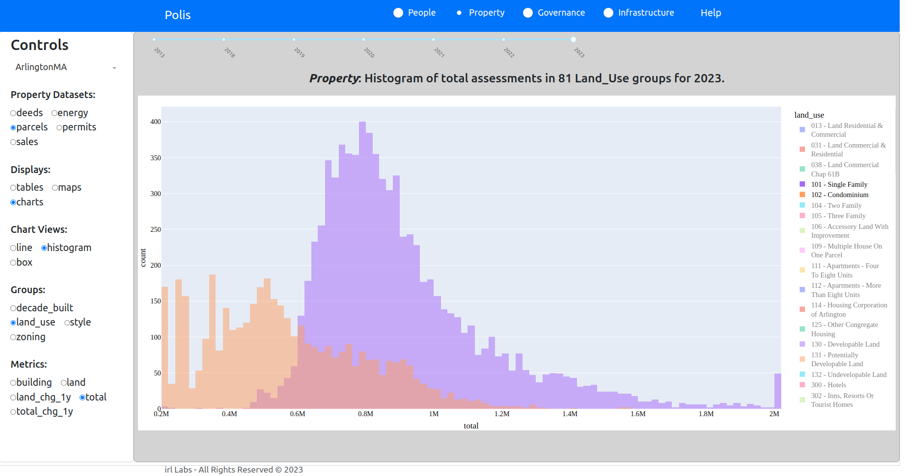
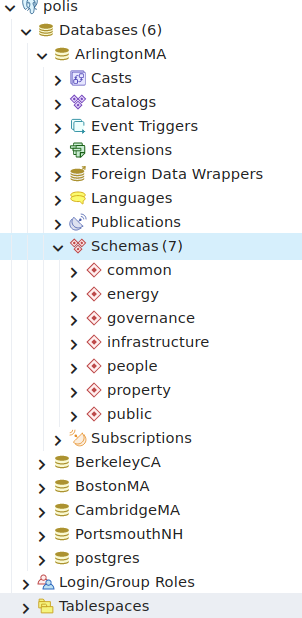

# [Polis](https://gitlab.com/irl-labs1/polis)

Polis is a tool that organizes public and private data through a scalable, normalized database and viewing portal.  Data brokers monetize public data, we seek to drive that value to zero in the context of sovereign data principles.  This is your information, use it wisely.

## Highlights

<video width="320" height="240" controls>
  <source type="video/mp4" src="https://raw.githubusercontent.com/irl-labs/polis/main/highlights.mp4">
</video>

## Description

Polis means city ([πόλις](https://en.wikipedia.org/wiki/Polis)) or more broadly a community.  Paraphrasing [Edith Hamilton](https://en.wikipedia.org/wiki/Edith_Hamilton), when two or more people come together, they form a ***polis***.

### Philosophy

Our philosophy around public and private data revolves around some simple guidelines:

    1. minimize changes to source data
    2. present all data in a uniform, easily accessible manner
    3. minimize data replication
    4. data sovereignity

All datasets have a defined source; for example a spreadsheet link or url of the public record keeper.  We minimize changes to source data using it *as is* with some notable exceptions.

### Architecture

People create property.  People and property require governance. People, property and governance create infrastructure. 

The [polis](https://irl-labs.org/polis) data structure reflects this hierarchy.  Polis organizes data into these four broad categories; people, property, governance, infrastructure.  

Energy is carved out of property as a fifth grouping because of the importance of energy to the future polis and the unique features developed for energy property, governance and infrastructure.  Energy is the currency of a polis.

Within the five (5) broad categories are fifteen (15) datasets.  Each dataset generally has three (3) representations as *tables*, *charts* and *maps*.  Each table, chart or map can have one of over 100 views of the dataset.  For example, a dataset table might have both *detail* and *summary* views.

A dataset view might have natural groupings.  For example, elections are grouped by *local* and *national* elections.  Many dataset views are grouped by year or date.  In some chart and map views, groupings are embedded as interactive legends.  The groupings are generally defined by the data source.

Each view may have multiple metrics.  For example, a chart plot might have both a *count* and a *value* metric.

Most data sets have multiple snapshots or timeseries with some municipalities having 30 years of financial data; 20 years of voting and local census (resident) information and a similar number of snapshots for property and infrastructure data sets.

Polis contains thousands of individual, pre-defined tables, charts and maps.

### Data

Each dataset has a corresponding extract, transform and load (ETL) [notebook](https://github.com/irl-labs/polis/blob/main/notebooks/energy/solar%20BNL%20ETL.ipynb) with a link in the view title.  Each of the fifteen (15) datasets has a corresponding database table of the same name.  

Categorical and personally indentifiable information (e.g. name and dob) is generally stored as a key.  Key, value pairs are in stored in common tables.  

For example, the *people* category might have 135 different observations of elections, registered voters and census (residents) results, as is the case for ArlingtonMA through 2023.  

Our datasets are labeled *elections*, *registered* and *residents*.  The corresponding database table (e.g. *people.elections*) has two columns; a *people_id* and a *date array*.  The more than 3 million observations of the 135 different recorded events (election, annual census) for 90,000+ individuals are stored in 230K rows of IDs and date arrays.  

Two additional tables contain the attributes of each people_id (name, dob, address_id, party affiliation, precinct) and the address (911-addresses and tax parcel property_id) as of the observed date.

In our example of ArlingtonMA through 2023 and 135 observations of 3 types of activity (elections, census, voter rolls) over a 20 year period, there are 90,000+ different individuals with over 30,000 different addresses in about 15,000 different tax parcels.  The 30,000 different addresses reflect the actual address recorded at each election or census recording which are stored on an *as-was* basis.

Not only does this condense the data for better network traffic performance, but allows for masking personally identifiable information (name, dob) at scale.

## Dashboard

The ***polis*** dashboard is written in python using the Dash and plotly packages; an easy to implement proof of concept.  [Contributions](CONTRIBUTING.md) for a more robust, better stylized front end are needed.

People, Property, Governance and Infrastructure (PPT) form the top level data heirarchy on the polis dashboard NavBar.

Each PPT has several data sets corresponding to different data sources; e.g. real estate **sales** falls under **property** with data source [LA3 parcels](https://dlsgateway.dor.state.ma.us/gateway/DLSPublic/ParcelSearch).

Each data set has three tabs; *tables*, *charts*, *maps*  on the control panel.  

Data sets with periodic (annual, quarterly) updates are selected using a date slider beneath the NavBar.

Select from a variety of views, groups and metrics from the control panel to the left.

Content views are either a dash [Graph figure](https://dash.plotly.com/dash-core-components/graph), [mapbox Map](https://plotly.com/python/scattermapbox/) or [dashTable](https://dash.plotly.com/datatable).

## Postgres

We use the open source [postgres](https://www.postgresql.org/) database for its geometry ([postgis](https://postgis.net/)) support and [decimal](https://www.postgresql.org/docs/9.4/datatype-numeric.html) data types.  Other database implementations are possible.

The dashboard connects directly to a containerized (docker) postgres database.  An api interface would create a more robust front-end implementation but also expand the user base to a wider audience.  [Contributions](Contributing.md) are welcome.

Each municipality is a postgres database, for example ***ArlingtonMA***.  Each database consists of seven (7) schemas; the five (5) categories of people, property, governance, infrastructure and energy as well as a *common* schema for cross reference and geometry tables and the postgres default *public* schema which includes the postgis extension.

We implemented seperate databases for each municipality to encourage local hosting and to minimize data storage costs.  The ArlingtonMA implementation is about 500M of data which is easily served, a US-wide database might be on the order of 20T of data.  Raw source datafiles and compressed database dumps can be shared using a [file sharing service](https://ipfs.tech/).  Local hosting is encouraged and provides a platform for non-public data to be incorporated within an organization.

Most datasets are scalable to all municipalities.  The ETL notebooks are readily adapted to cover all municipalities in Massachusetts with little modifications.  The financials.dor_databank includes all municipalities in Massachusetts.

## Installation

Assumes docker.

    1. create and activate a virtual environment
    2. git clone https://github.com/irl-labs/polis
    3. cd polis/app
    4. docker build -t irllabs/polis .
    5. cd ../ ; docker compose up -d

This starts two containers; one is the polis app you built, the second is a postgres database with the postgis extentions, "polis" user and default database creation.  The postgis is other wise empty and needs to be updated with the latest data.

     6. psql -v ON_ERROR_STOP=1 --host localhost --port 5436 --username=polis ArlingtonMA -f db.sql

## Usage

docker compose up -d

## Support

[twitter](@irl-labs)

## Roadmap

   1. Public repo, summer 2023
   2. Homomorphic encryption of PII, summer 2023
   3. Web app, summer 2023
   4. API, fall 2023
   5. New municipalities; BostonMA, CambridgeMA, BerkeleyCA fall 2023
   6. Solar tokens, fall 2023
   7. Adaptive microgrid views, winter 2023
   8. Replace front-end, spring 2024

## [Contributing](Contributing.md)   

   1. Data fixes     
   2. Code development   
       a. front end   
       b. back end   
       c. new views
   3. Data   
      a. new sources   
      b. new front-end   
   4. Analysis   
      a. write blog posts   
      b. create new charts, maps and tables   
   5. Support    

## Authors and acknowledgment

Thanks to Maria, Chris, Matt, Kristin for insights, encouragements, code fixes and quality time.

## License
[Creative Commons Attribution-ShareAlike 4.0 International License](LICENSE.md)

## Project status

Freshly relaunched, join us!

