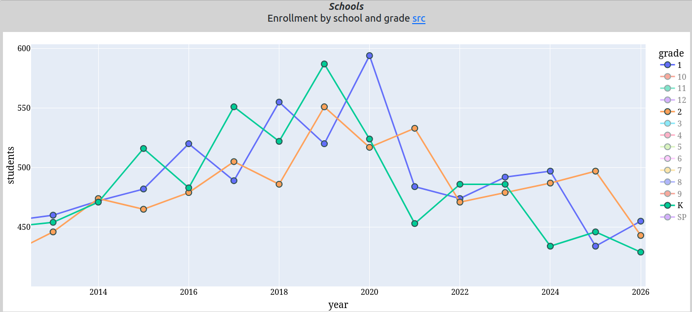

# APS enrollment decline K-2  
   
What caused the 2014-2020 baby bump in the Arlington public school enrollments, you ask?  

Below is the same [chart]() of Enrollment by grade for grades K-2 that we saw last time, zoomed in for the period FY2013 - FY2026.  The green line is Kindergarten enrollment for each school year (fiscal year), the blue line is first grade and the orange line is second grade.  

  

## Tale of the Tape  

Notice that on October 1, 2013 (FY2014), kindergarten, first and second grade had almost the same number of students (472+-2) enrolled.  Also, note the divergence in FY2015 with a large increase in enrollment.  

Not coincidentally, the $3000 fee the APS had charged parents for kindergarten was eliminated in October of 2012 (FY2013) for the FY2014 year.  Soon after, K enrollment skyrocketed, and grade 1 the year after and then grade 2 2 years later showing similar variability.  Lagging the grades to superimpose the enrollments and look at &quot;cohort&quot; fluctuations are very informative for observing attrition rates, especially in later grades (e.g. grades 6,7,9).  Attrition, autocorrelation and heteroskedasticity analysis is left as an exercise for the reader.  

The K-2 enrollment growth continued, peaking in FY2020 (October, 2019 enrollment reporting) at about 1640 students combined K-2.  Then the pandemic, which saw K-2 enrollments fall from 1640 to 1470 or so; about 12% drop in FY2021.  Enrollments never bounced back in the K-2 cohorts, and kindergarten enrollment seems to have taken another &quot;leg down&quot; in FY2024.  Looking at the chart, Arlington should expect fewer first grade students, slightly more second grade students, and only the schools should know how many kindergarten students.  Note that the number of K-2 students in FY2026 is lower than the number of K-2 students in FY2014.  

The baby bump highlighted last time as columnar data, ignited around the same time as free kindergarten, overlaps directly with the K-2 enrollments graphic.  

## Conclusions  

- The APS enrollment growth will be closer to the historic 1.5% and not the 3.4% annualized growth during the 2014-2019 baby bump.  
- In 5 years, middle school enrollments will start to decline.  
- In 10 years, high school enrollments will start to decline to less than 1700 students.  
  
***APS Admin should understand why K-2 enrollment continues to decline below 2014 levels.***  

