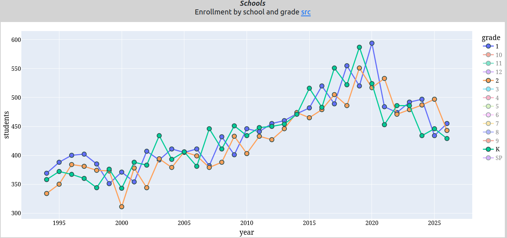
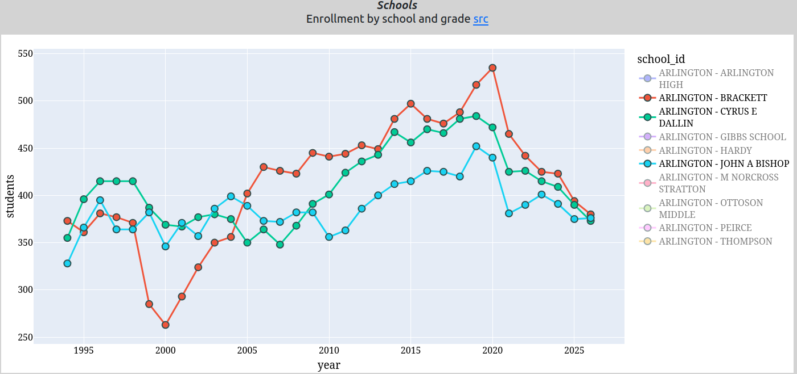
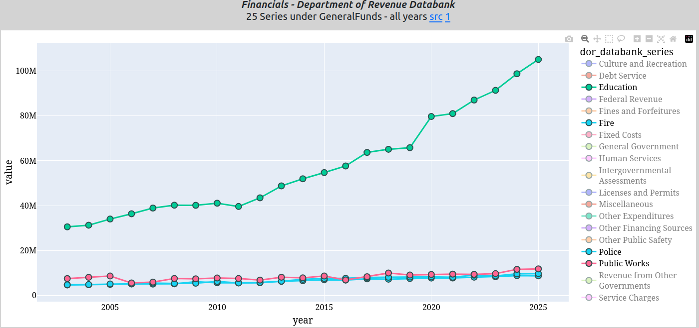

# School enrollment 1.41% average annual increase. School spending 5.78% average annual increase.  

*Statistics are like bikinis. What they reveal is suggestive, but what they conceal is vital.*  

Or rephrased, what is concealed by statistics matters far more than what is revealed by statistics.  

Paul Schlichtman, former chair of the Arlington School Committee, opines regularly misusing statistics to deceive the public.  Let&#x27;s give a few examples germane to the override where Paul conceals inconvenient truths.  

## APS Enrollments  

Mr. Schlichtman wrote:  

*On October 1, 2015, Arlington High School enrolled 1,253 students.*  
*On October 1, 2025, Arlington High School enrolled 1,757 students.*  
*That’s about 40% increase over ten years.*  

Wow, hair on fire!  Let us look at the district wide APS enrollment over the past 30+ years; all enrollment numbers from MA DESE  

| Year | Students | YoY %              |                         |                        |
| :-----| :--------:| -------------------:| ------------------------:| -----------------------:|
| 1994 | 3801     |                    |                         |                        |
| 1995 | 3934     | 3.50%              |                         |                        |
| 1996 | 4028     | 2.39%              |                         |                        |
| 1997 | 4085     | 1.42%              |                         |                        |
| 1998 | 4146     | 1.49%              |                         |                        |
| 1999 | 4205     | 1.42%              |                         |                        |
| 2000 | 4165     | -0.95%             |                         |                        |
| 2001 | 4215     | 1.20%              |                         |                        |
| 2002 | 4253     | 0.90%              |                         |                        |
| 2003 | 4481     | 5.36%              |                         |                        |
| 2004 | 4425     | -1.25%             |                         |                        |
| 2005 | 4486     | 1.38%              |                         |                        |
| 2006 | 4522     | 0.80%              |                         |                        |
| 2007 | 4548     | 0.57%              |                         |                        |
| 2008 | 4532     | -0.35%             |                         |                        |
| 2009 | 4654     | 2.69%              |                         |                        |
| 2010 | 4713     | 1.27%              |                         |                        |
| 2011 | 4808     | 2.02%              |                         |                        |
| 2012 | 4858     | 1.04%              |                         |                        |
| 2013 | 4903     | 0.93%              |                         |                        |
| 2014 | 5020     | <mark>2.39%</mark> |                         |                        |
| 2015 | 5208     | <mark>3.75%</mark> |                         |                        |
| 2016 | 5304     | <mark>1.84%</mark> |                         |                        |
| 2017 | 5524     | <mark>4.15%</mark> |                         |                        |
| 2018 | 5711     | <mark>3.39%</mark> |                         |                        |
| 2019 | 5939     | <mark>3.99%</mark> | <mark>**21.13%**</mark> |                        |
| 2020 | 6047     | 1.82%              |                         |                        |
| 2021 | 5755     | -4.83%             |                         |                        |
| 2022 | 5866     | 1.93%              |                         |                        |
| 2023 | 5987     | 2.06%              |                         |                        |
| 2024 | 5997     | 0.17%              |                         |                        |
| 2025 | 6113     | 1.93%              |                         |                        |
| 2026 | 6098     | -0.25%             | <mark>**1.49%**</mark>  | <mark>**1.41%**</mark> |
  
  
The table above shows the fiscal year (latest enrollment is FY2026), the number of enrolled students (including PK) reported to DESE in October and the third column (YoY) is the Year on Year percent change of enrolled students.  

The numbers off to the side in the last row, 1.49% and 1.41%, are the annualized growth in enrollment averaged over the entire series (1.49%) and since 2003 (1.41%).  

Since 2005, when DESE started to collect teacher employment statistics, the number of full time equivalent teachers reported by DESE has increased by almost  60%, while the number of students has increased less than 40%.  Administrator bloat is obvious.  

NB school enrollment growth in the Arlington public schools averages less than 1.5% per year.  

The highlighted fiscal years in yellow, 2014 - 2019, are a baby bump when over a six year period enrollment grew by more than 21% while the past 6 years, 2020 - 2025, enrollment growth is closer to the historic average of &lt;1.5% (sans the pandemic).  Also note, enrollments are down and a ceiling of about 6100 students seems to have formed.  

## Enrollment trending down in K-2  

The chart below shows the yearly enrollment data from MA DESE for kindergarten, first and second grades.  Note the peak in FY2020, before the pandemic, the sharp drop in enrollments during the pandemic and, most importantly, the continued decline since then.  

While Mr. Schlichtman focuses on seniors (grade 12) in highlighting the demands on schools, essentially the past, he ignores the future which shows fewer students entering into the Arlington public schools.  My prediction, APS enrollment has peaked.  
  
  

As an aside.  Below is a chart of the enrollment history of three selected elementary schools; Brackett, Bishop and Stratton.  Note the enrollment decline across all three schools since the pandemic showing a clear down trend.  The only school that somewhat defies this trend is Thompson.  Property values are the highest in Arlington for the neighborhoods serviced by these three schools, while condo conversions dominate the development in Arlington over the past 20 years in East Arlington; condos contribute the least to property tax growth.  Taxpayers who contribute the most property tax dollars, benefit the least from that spending.  

  
  
## Money  

The largest single expense, and the fastest growing expense in Arlington, is public education.  The MA Department of Revenue maintains a databank of municipal financial data with annual data since 2003.  This data is extracted from the annual, audited financial statements and some of the categorizations are not the same as reported by local officials, most notoriously by the Finance Committee&#x27;s reports to Town Meeting.  Below, we focus on the General Fund expenses reported to MA DOR.  

Below are the expenses for selected General Fund GAAP reporting for the latest available fiscal year (2025).  The year on year change (YoY) is the  increase/decrease from the prior fiscal year.  The Annualized column is the average annual change over the past 22 years since 2003.  
  
| Year | Expense      | Department                    | YoY %   | Annualized %           |
| :-----| -------------:| :------------------------------| --------:| -----------------------:|
| 2025 | $2,868,456   | Culture and Recreation        | 6.54%   | 0.73%                  |
| 2025 | $4,077,654   | Intergovernmental Assessments | 3.00%   | 1.62%                  |
| 2025 | $11,813,138  | Public Works                  | 1.79%   | 2.08%                  |
| 2025 | $29,119,855  | State Revenue                 | 2.90%   | <mark>**2.43%**</mark> |
| 2025 | $8,733,620   | Fire                          | -0.87%  | 2.89%                  |
| 2025 | $9,719,188   | Police                        | 1.09%   | 3.34%                  |
| 2025 | $8,698,445   | General Government            | 3.74%   | 3.51%                  |
| 2025 | $224,209,281 | Total Revenues                | 4.27%   | 4.38%                  |
| 2025 | $214,261,644 | Total Expenditures            | 2.56%   | 4.54%                  |
| 2025 | $173,783,072 | Taxes                         | 7.61%   | <mark>**4.57%**</mark> |
| 2025 | $41,475,674  | Fixed Costs                   | 5.49%   | 4.72%                  |
| 2025 | $1,605,229   | Human Services                | 3.71%   | 4.92%                  |
| 2025 | $19,929,471  | Debt Service                  | -16.04% | 5.19%                  |
| 2025 | $105,101,294 | Education                     | 6.44%   | <mark>**5.78%**</mark> |
| 2025 | $11,358,859  | Transfers                     | 2.29%   | 8.70%                  |
| 2025 | $4,952,608   | Licenses and Permits          | -1.79%  | 9.74%                  |
| 2025 | $4,111,604   | Miscellaneous                 | 9.34%   | 11.02%                 |
  
- Taxes (almost exclusively property taxes) have increased an average of <mark>**4.57%**</mark> per year each year over the past 22 years.  
- Education spending has increased by an average of <mark>**5.78%**</mark> per year over the past 22 years.  
- State aid has increased an average of <mark>**2.43%**</mark> per year over the past 22 years.  

When you hear the narrative that property taxes are capped at 2.5% a year, it is either ill-informed or designed to deceive you.  
  
Some will admit, these expenses are dominated by salaries of our public employees.  The data reveals, teachers are rewarded much more, every year, than firemen, policemen, DPW workers or other town-side employees.  

The state aid numbers, with state aid clearly under the rate of inflation or even property tax baseline, indicates Arlington&#x27;s Beacon Hill delegation; Friedman, Garballey, Rogers and Brownsberger are not effective at insuring Arlington residents receive their fair share of state resources.  

Below is a chart showing the annual expenditures for education, fire, police and DPW.  Note how the compounding effect of even 2x per year (2.5% vs 5.78%) creates huge disparities.  

  

Our analysis above covers General Fund spending; e.g. salaries, operating expenses.  The education spending quoted here does not include capital expenses, health care costs or retirement benefits.  DESE quotes a ~$20K per pupil expense. which wildly understates the actual cost; the AHS rebuild added $2200 per student per year for the next 30 years.  There is no way for a family with 2 children in the APS to pay that benefit ($780,000) thru property taxes (~$6K per year or $78,000 over 13 years of K-12 for two children),  

## Recap  

- School enrollment growth averages 1.41% per year, but expenses rise an average 5.78% per year; a 4X disparity.  
- Property taxes increase, on average, more than 4.5% per year over the past 2 decades.  
- Arlington spends more than $30K per student each year, covered by $6K in property taxes per household.  
- Arlington over-invests in education and under invests in waste collection, road maintenance and public safety by 3X each year for the past two decades.  
- You should discount whenever officials and override supporters claim that the override is about &quot;our&quot; &quot;values&quot; and not a simple exercise in arithmetic, know them for the charlatans they reveal themselves to be.  
- Don&#x27;t fall for the &quot;what would you decrease&quot; argument intended to be divisive and pit residents against each other.  Residents should expect our well paid, out of town &quot;leaders&quot; to live within a budget that does not require regular overrides which makes Arlington less affordable, is unsustainable and has little impact on outcomes.  
- Mr. Schlichtman needs a larger bikini, his statistics are showing.  