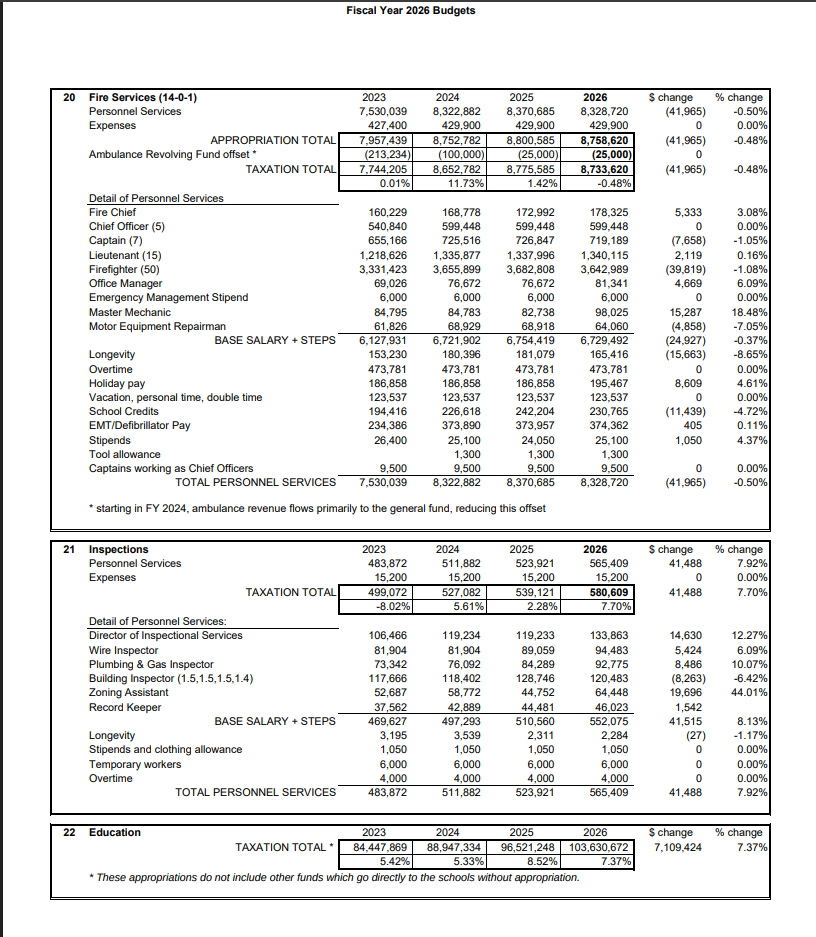
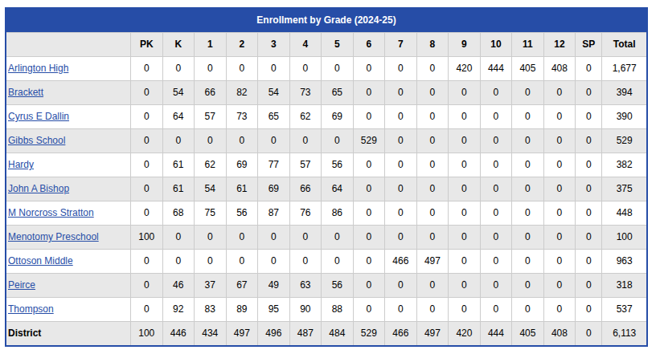
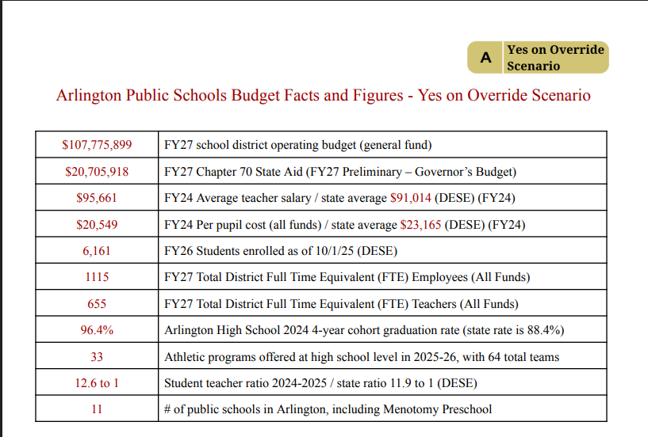
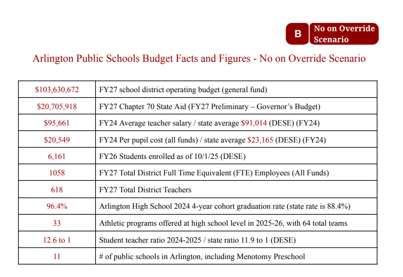
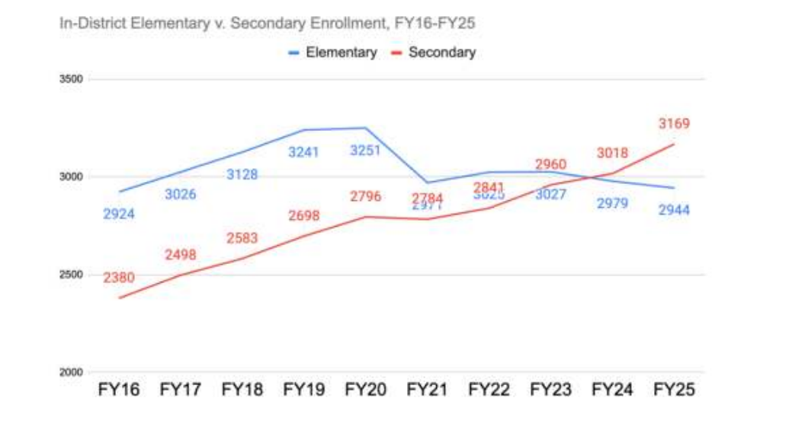
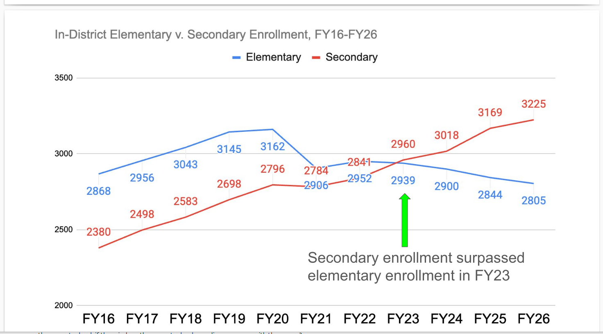
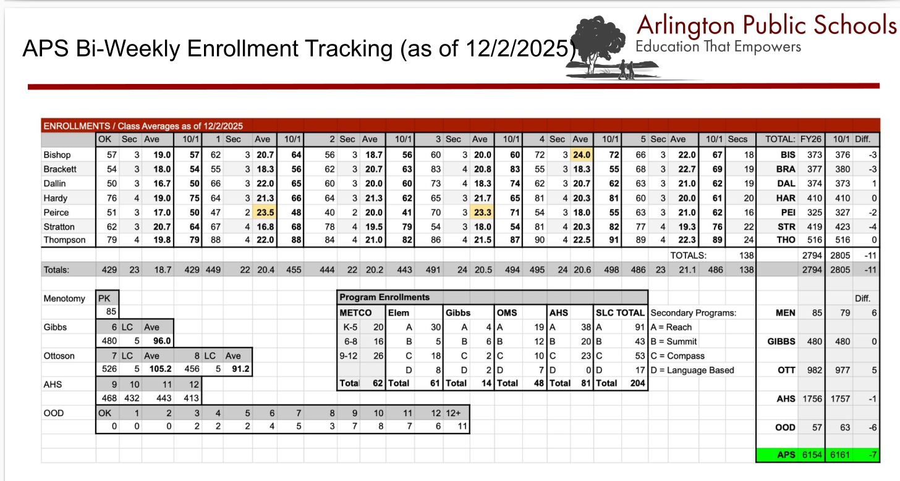

# Budget Fudge It  
   
***tl;dr Arlington&#x27;s structural deficit is due to:*** 

- lack of local, meaningful, independent oversight of APS finances  
- myriad, inconsistent financial presentations  
- poor budget practices - &quot;growth rate&quot; as a ratchet, unconstrained payroll expansion, carry forward unfilled positions  
- mission creep - daycare, babysitting, community ed, preschool  
- fearful voters - emotionally manipulated by town officials   

## Oversight of APS finances  

Town Meeting (TM) is the appropriating authority in Arlington. The Finance Committee (FinCom) is the committee that reviews budgets for TM and recommends votes on all financial articles.  There are 21 members, one from each precinct (generally) and not always TMMs.  FinCom is the financial representative for the TM representatives. [FinCom&#x27;s FY2026 report to TM can be found here](https://www.arlingtonma.gov/home/showpublisheddocument/73684/638802179946530000).  

Page B-12 of the [FY2026 FinCom report to TM](https://www.arlingtonma.gov/home/showpublisheddocument/73684/638802179946530000), with the Fire ($9M), Inspections ($600K) and Education ($100M) budgets, is reproduced below.  
  
  

Note that the Fire and Inspections budgets follow the financial presentation format of all other budgets in the FinCom report to Town Meeting with personnel expenses (payroll) listed by job classification, the Steps and Longevity pay, etc.  On the other hand, the FinCom report to Town Meeting for the Education budget is just a bottom line number with a footnote indicating an &quot;off balance sheet&quot; revenues and expenses; always a red flag.  

***Consistent financial presentations matter.***  

Town officials will tell TMMs that you are *only* allowed a Yes/No vote for the totality of the Education budget. In the past, even a $1 change in the Education budget has been rejected at Town Meeting.  
  
Finally, the FinCom, tasked with reviewing every budget, has not yet as of [2/24/2026, reviewed the APS Education budget for FY2027](https://www.arlingtonma.gov/home/showpublisheddocument/73684/638802179946530000).  But not to worry, FinCom voted to support the largest override in MA state history without reviewing or voting on the single largest budget buster in Arlington&#x27;s local government.  Someday, before the override in about one month even, FinCom will have its chance.  

## Myriad, Inconsistent Financial Presentations  

Ahh, you smirk, the APS provides budgets - a massive 135 page (2/12/2026) [Arlington Public Schools Superintendent’s FY27 Proposed Budget](https://4.files.edl.io/34d2/02/18/26/170952-ff8ad1d8-4b4a-4ee3-852e-e049b0de2a31.pdf), the 22 page (1/14/2026) [Planning for Uncertain Times](https://4.files.edl.io/d516/01/20/26/132141-6ff5f192-0982-46a1-916d-745391223ed2.pdf), the 32 page (2/18/2026) summary for public consumption, as well as a gaggle of presentations, forums, family gatherings and social media posts.  As for FinCom oversight, the APS has &quot;subcommittees&quot;; at least one of which is a budget subcommittee. Since both the School Committee and its subcommittees have no appropriating authority there are few of the usual standards or safeguards surrounding financial accounting.  

APS financial presentations are difficult to follow with key metrics inconsistent, details poorly presented, historic student enrollment repeatedly revised,assertions that fail under scrutiny framed by false choices.  The following is a sample of each, motivated by the reported number of FTE Teachers and enrolled students.  

## Key Metrics  

Recall, the APS budget presentation to Town Meeting FY2026 key metrics:  

  

    
    
<em>Key Metrics FY26</em>

  

  

    
    
<em>DESE Enrollment</em>

  

  
The students enrolled (6,113 as of 10/1/2025 - DESE) divided by the Teachers (668 FTEs budgeted FY26) is a number less than 10, not the [12.2 to 1 Student teacher ratio](https://profiles.doe.mass.edu/profiles/teacher.aspx?orgcode=00100000&orgtypecode=5&&fycode=2024), even correcting for FY24 report date.  

DESE confirms the number of [FY25 students (6,113)](https://profiles.doe.mass.edu/profiles/student.aspx?orgcode=00100000&orgtypecode=5&&fycode=2025) but shows [484.3 FTE teachers for FY25](https://profiles.doe.mass.edu/profiles/teacher.aspx?orgcode=00100000&orgtypecode=5&&fycode=2025).  The student/teacher ratio, 6113 /484.3 = [12.6 confirmed by DESE](https://profiles.doe.mass.edu/profiles/teacher.aspx?orgcode=00100000&orgtypecode=5&&fycode=2025).  

Now let&#x27;s look at Superintendent&#x27;s FY2027 Budget Key Metrics with totals for FTE Teachers and students enrolled, see two images below for both the Yes and NO override scenarios.  We know the DESE reported student enrollment is 6,098, a decrease from 6,113 from FY25, but the Key Metric report shows FY26 students enrolled at 6,161.  
  

  

    
    
<em>Yes Override - Key Metrics</em>

  

  

    
    
<em>No Override - Key Metrics</em>

  

No doubt, the 6,161 FY26 enrolled students reported by the APS includes other populations (e.g. Out of District or Charter School Sending students), but the financial reporting inconsistencies from year to year are concerning.  Notice also the FTE Teachers; even with an override, the APS plans on &quot;eliminating&quot; at least 13 FTE Teachers.  

It gets worse.  

## Historic Student Enrollment Revised  

Below are two students enrollment, In District, the one on the left from the School Committee Report to the FY2026 Town Meeting last May, 2025 showing In-District enrollment for the past 10 years or so.  The image on the right show the FY27 Superintendent&#x27;s Budget Proposal.  

  

    
    
<em>Student Enrollment FY26 TM Report</em>

  

  

    
    
<em>Student Enrollment FY27 Budget Report</em>

  

  
- The FY27 budget being presented this week, the chart on the right, the FY26 already booked In-district student enrollment is 3,225 (Secondary) + 2,805 (Elementary) = 6,030.  
- 6,030 students reportedly enrolled compared to DESE&#x27;s FY26 actual enrollment at 6,098.   
- The FY25 enrollment numbers on the left hand chart (3169+2944 = 6,113) match the FY25 DESE enrollment numbers.  
- The FY27 budget shows 2844 Elementary students enrolled in FY25 compared to the FY26 budget that had 2944 Elementary students enrolled in FY25.  
- Every historic student enrollment number from FY16 - FY26 has been changed in the current FY27 budget.  

***Every historic elementary student enrollment number from FY16 - FY26 on this chart has been changed/differs in the current FY27 budget presentation from the FY26 budget presentation from May 2025.***  

APS produces inconsistent financial presentations.  

## Classroom Size Anomaly  

Also in the APS budgets are this class size averages, for yet another point-in-time reporting.  FWIW this is how we identified the OOD students as part explanation for the FY26 enrollment differences.  

  

Note the elementary classroom size are about 20 students per classroom, each led by 1 teacher.  A 20:1 student teacher ratio.  

The alert reader recalls, the Key Metrics section of the budget claimed a 12.6:1 student teacher ratio, see above, although the APS reported teachers give closer to a 9:1 student teacher ratio.  To reconcile the differences, we dive into why and how the APS defines teachers and how that differs from MA DESE.  For now, the reality is there are two or more adult &quot;FTE Teachers&quot;, using the APS expansive definition of teacher, in the elementary classrooms.  The scare tactic of increased classroom sizes is nonsense; the student-teacher ratios in the elementary classrooms is more like 9:1 with some 7:1.  

## False Choices  

The APS released its budget plans, one for a successful $14.8M override, the other for a No vote.  In the case of a No override vote, the Superintendent claims that the Town Meeting appropriation will remain unchanged from last year at $103M or so.  Unlike Town officials, I interact with a lot of No override voters.  None, not one, suggests that the APS should be &quot;level funded&quot; from property taxes.  The overwhelming majority merely wish the APS stick to a 2.5% budget increase, sans an override.  Some other examples of officials making false choices from the budget presentations:  

*Arlington can balance its budget by increasing funding or decreasing spending.*  
*APS will receive the same amount of funding in FY27 as it received in FY26.*  

## FTE Teachers  

The APS key metric of 668 Teachers differs from the 484.3 DESE report by ~38%. Obviously, the APS has a different definition of a teacher than does the State.  Using the APS definition of FTE Teachers leads to inconsistencies in other reported key metrics as seen above.  We try to reconcile the various definitions of FTE Teacher in the next section.  

An attached spreadsheet works out the various summaries by location, job classification, teacher vs staff by payroll.  

The Arlington Public Schools provided the W2 earnings for each of the last three calendar years with columns for Location and Job Class for anyone issued a W2.  Everything presented below is filtered for anyone issued a W2 for 2025; after removing half a dozen negative and zero earnings in the file.  

- 2717 rows, multiple Location, Job Class for some employees.  
- 773 Teacher rows, see below.  
- 689 unique teacher names.  
- 1944 Staff rows, see Staff section.  
- 1418 unique staff names; many staff (subs/students) are paid a pittance.  
- 187 different Job Classifications.   187!  

The next two sections details Teacher and Staff employees by location and job classification.  
  
## Teachers  

Teacher Job Class Payroll Summary  

There were 689 individuals who had W2 earnings in calendar year 2025, some multiple employees with multiple rows (mid-year promotions?) showing a total of 773 roles under the following Job Classifications as provided by the APS.  

| Job Class                         | Count                | Payroll                      |
| :----------------------------------| :--------------------:| -----------------------------:|
| SMLW - MASTERS 21 SYSTEM WIDE     | 3                    | $273,666                     |
| SMLM - MASTERS 21 MIDDLE SCHOOL   | 15                   | $838,355                     |
| SMLH - MASTERS 21 HIGH SCHOOL     | 12                   | $772,733                     |
| SMLE - MASTER 21 ELEMENTARY       | 23                   | $1,237,887                   |
| SML+ - MASTER+15 21 PAY PERIODS   | 21                   | $1,461,151                   |
| SMBW - MASTERS 26 SYSTEM WIDE     | 7                    | $735,437                     |
| SMBM - MASTERS 26 MIDDLE SCHOOL   | 76                   | $5,985,374                   |
| SMBH - MASTERS 26 HIGH SCHOOL     | 69                   | $5,142,545                   |
| SMBE - MASTERS 26 ELEMENTARY      | 153                  | $11,694,120                  |
| SMB+ - MASTERS+15 26 PAY PERIODS  | 79                   | $6,670,268                   |
| SILW - MATH COACH 21              | 2                    | $193,809                     |
| SILS - MATH INTERVENT/SUPPORT 21  | 2                    | $144,226                     |
| SIBW - MATH COACH 26              | 5                    | $362,011                     |
| SIBS - MATH INTERVENT/SUPPORT 26  | 4                    | $435,685                     |
| SDLM - DOCTORATE 21 MIDDLE SCHOOL | 4                    | $278,063                     |
| SDLH - DOCTORATE 21 HIGH SCHOOL   | 5                    | $377,866                     |
| SDLE - DOCTORATE 21 ELEMENTARY    | 7                    | $236,853                     |
| SDBW - DOCTORATE 26 SYSTEM WIDE   | 3                    | $161,647                     |
| SDBM - DOCTORATE 26 MIDDLE SCHOOL | 13                   | $1,031,152                   |
| SDBH - DOCTORATE 26 HIGH SCHOOL   | 24                   | $2,065,659                   |
| SDBE - DOCTORATE 26 ELEMENTARY    | 28                   | $2,251,561                   |
| SCLW - CAGS 21 SYSTEM WIDE        | 3                    | $117,338                     |
| SCLM - CAGS 21 MIDDLE SCHOOL      | 3                    | $240,599                     |
| SCLH - CAGS 21 HIGH SCHOOL        | 6                    | $402,675                     |
| SCLE - CAGS 21 ELEMENTARY         | 8                    | $657,922                     |
| SCBW - CAGS 26 SYSTEM WIDE        | 9                    | $564,495                     |
| SCBM - CAGS 26 MIDDLE SCHOOL      | 20                   | $1,729,777                   |
| SCBH - CAGS 26 HIGH SCHOOL        | 34                   | $2,552,938                   |
| SCBE - CAGS 26 ELEMENTARY         | 61                   | $5,029,313                   |
| SBLW - BACHELOR 21 SYSTEM WIDE    | 1                    | $32,466                      |
| SBLM - BACHELORS 21 MIDDLE SCHOOL | 4                    | $176,056                     |
| SBLH - BACHELOR 21 HIGH SCHOOL    | 3                    | $135,648                     |
| SBLE - BACHELOR 21 ELEMENTARY     | 5                    | $228,046                     |
| SBL+ - BACHELORS+15 21 PP         | 3                    | $158,859                     |
| SBBW - BACHELOR 26 SYSTEM WIDE    | 1                    | $49,724                      |
| SBBM - BACHELOR 26 MIDDLE SCHOOL  | 14                   | $653,779                     |
| SBBH - BACHELOR 26 HIGH SCHOOL    | 7                    | $428,198                     |
| SBBE - BACHELOR 26 ELEMENTARY     | 12                   | $732,797                     |
| SBB+ - BACHELOR +15 26 PP         | 24                   | $1,291,062                   |
| <mark>**Total**</mark>            | <mark>**773**</mark> | <mark>**$57,531,764**</mark> |

The Table above shows 773 &quot;teachers&quot; since about 90 employees held multiple Job Classifications over the course of the 2025 calendar year or were paid from multiple Locations, see table further below.  There is no doubt I missed labeled some &quot;teachers&quot; as staff, for examples Paraprofessionals and  
SPEDs.  These employees will show up in the Staff tabs in the attached spreadsheet, the reader can adjust the teacher counts above.  

Note, the DESE teacher count of 484.3 FTEs differs dramatically from the mid 600s reported variously in APS presentations and documents.  Using some simple heuristics to estimate partial year vs half year vs full year employees did reduce the number of FTE teachers to 519.  

***Payroll detail from W2s should be extended back 10 years with employee start and end dates for better FTE reproduction.***  

Observations on Teacher Payroll  

- The total combined payroll for &quot;teachers&quot; is about $58M.  
- The total W2 earnings payroll for the APS in calendar year 2025 is about $95M.  
- Teachers are 60% of the APS payroll, everything else is 40%.  
- The median YoY percent increase in teacher W2 earnings is 7%.  
- The average annual increase (CAGR) in the APS payroll has been 6.9% over the past 10 years.  
- 80 of the lowest paid teachers do not have professional status ( paid less than $40K, two years of W2 earnings, but not three ).  
- The average pay for the lowest paid teachers without professional status is about $27,500.  

## Staff

Below are three Job Classifications which are under our staff labeling and may be labeled as teachers in other presentations.  

- Teacher Assistants add 183 bodies with payroll of $3.7M  
- SPED PARAs add 130 employees with payroll $3M  
- Substitute Teachers add 490 employees with payroll of $1.6M; less than 2% of payroll.  

APS officials have warned of 22 teacher cuts if the $14.8M override fails.  Assuming the 80 lowest paid teachers without professional status would bear the brunt of the warned 22 teachers &quot;eliminated&quot;, more fear words in APS budget presentations, that is about $600K.  Fully loaded (1.5x for heath care, etc.) and those cuts reduce the APS budget by $900K.  

Payroll Summary for Staff by &quot;Location&quot; and Job Classification, see excel tabs  

Payroll for APS staff/non-teachers with employee count (not FTE)  

| Category               | Staff                 | Payroll                      |
| :-----------------------| :---------------------:| -----------------------------:|
| Admin                  | 133                   | $6,646,717                   |
| Schools Admin          | 57                    | $4,156,050                   |
| TA                     | 183                   | $3,712,150                   |
| Custodians/Maintenance | 59                    | $3,515,307                   |
| SPED PARAs             | 130                   | $3,045,259                   |
| After School Daycare   | 167                   | $2,647,990                   |
| SPED                   | 132                   | $1,768,230                   |
| Substitutes            | 516                   | $1,706,111                   |
| Health                 | 40                    | $1,690,902                   |
| Guidance               | 21                    | $1,621,944                   |
| Bus                    | 25                    | $1,278,505                   |
| Food                   | 82                    | $1,101,493                   |
| Community Ed           | 158                   | $1,016,389                   |
| IT                     | 15                    | $873,269                     |
| Preschool              | 32                    | $798,522                     |
| Baby Sitting           | 24                    | $437,871                     |
| Library                | 14                    | $375,186                     |
| METCO                  | 8                     | $284,649                     |
| Coaches                | 64                    | $257,651                     |
| Crossing Guards        | 32                    | $241,700                     |
| Tutors                 | 13                    | $189,148                     |
| Lunch Ladies           | 23                    | $131,699                     |
| Retirees               | 13                    | $116,980                     |
| Math Admin             | 3                     | $52,399                      |
| <mark>**Total**</mark> | <mark>**1944**</mark> | <mark>**$37,666,118**</mark> |

Observations on Staff Payroll

- Menotomy Preschool teacher payroll for 2025 is $1.2M and Staff payroll of about $800K.  DESE reports 79 students in preschool as of 10/1/2025 - $25,300 per pupil salary expense for less than $7K tuition.  
- After School Daycare payroll is over $2.6M  
- Community Education payroll is more than $1M  

Why are these functions not provided thru Enterprise Funds for a cost covering expenses? Where in the APS budget are the revenues (tuition/fees) for these programs?  Want to close a $5.4M budget deficit?  Make Preschool, Daycare, Baby Sitting and Community Education enterprise funds funded by use taxes.  
 
