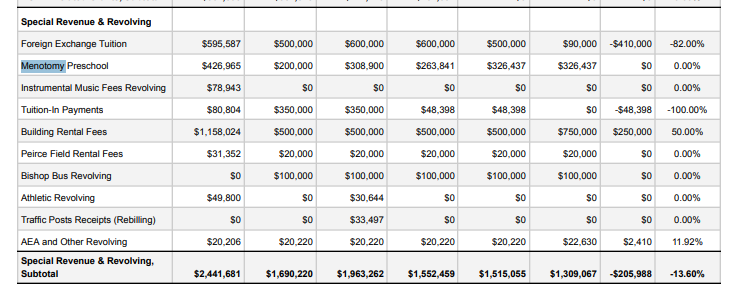

# Fee Revenues from AASP and Community Education  

I saw APS CFO Christopher Schweitzer answer to my question regarding payroll expenses for the After School (AASP) and Community Education programs at timestamp [51:58 in the video](https://d3id26kdqbehod.cloudfront.net/ARLPS/2026/02/25/GdCeSa1QjAqNO9Xzca3uka4ggwQMGHJdMgQyU85xNW4giVR6jgn7uWjx5pUj/Community+Budget+Forum+%233-480p.mp4) from the Superintendent&#x27;s budget presentation last night.  

My question was where in the budget could I find the fee revenue for these programs.  Schweitzer answer, if I heard it correctly,was that these two programs in particular are &quot;self-sustaining&quot; in that the payroll, rental and supply expenses were completely funded through fee revenue.  

In the [FY27 budget proposal on page 117](https://4.files.edl.io/34d2/02/18/26/170952-ff8ad1d8-4b4a-4ee3-852e-e049b0de2a31.pdf), a table titled  &quot;Special Revenue &amp; Revolving&quot; lists the revolving funds, reproduced below:  

  

I did not see the AASP or Community Ed Revolving Fund or other.  I do see Menotomy Preschool, Music, Athletics, etc. as expected, but none other.  What am I missing?  

The only references in the budget that I found was near the last page (pg. 134) under  &quot;Grant and Revolving Positions&quot;, the FTE positions for both AASP and Community Ed, along with APS Childcare; see below:  
  
  

The reason this matters is AASP and Community Education positions are reported in the budget and the W2 payroll for calendar year 2025 totals more than $3.6M in salary expense for these two programs.  Surely, to show these programs are self-sustaining, the fee revenue must be recorded somewhere, and presumably recognized in the full APS budget to offset the expenses.  

Would you please, guide me to where on the FY27 budget proposal the fee revenues for the AASP and Community Education are recorded?  Or on town side Enterprise Funds or Revolving Funds.  
 
