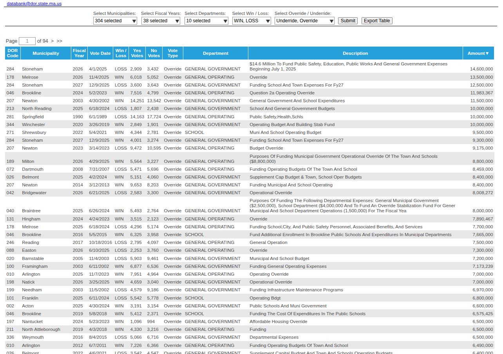
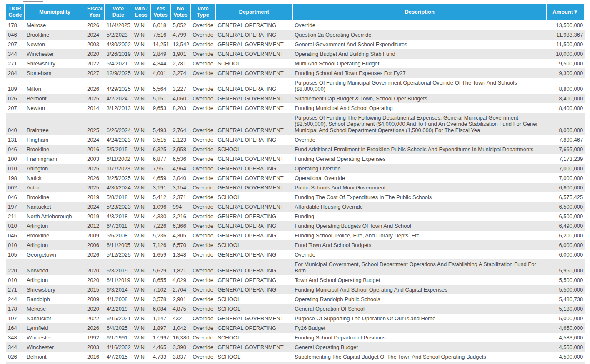
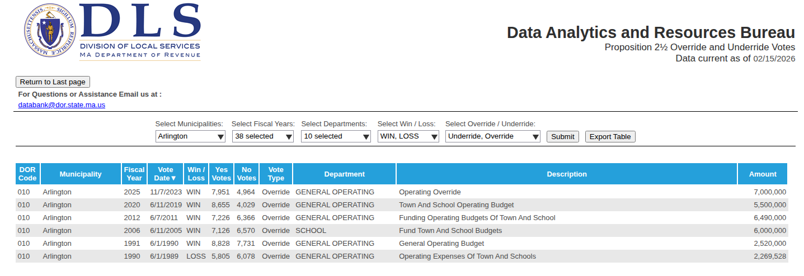

# History of Overrides  
  
The MA Dept of Revenue maintains a list of all overrides and underrides for all MA municipalities over the past 38 years on its website:  

[https://dls-gw.dor.state.ma.us/reports/rdPage.aspx?rdReport=Votes.Prop2_5.OverrideUnderride](https://dls-gw.dor.state.ma.us/reports/rdPage.aspx?rdReport=Votes.Prop2_5.OverrideUnderride)  

Sorting by the last column “amount” in descending order, note that the proposed $14.8M override is the largest in MA history. See attached pic.  
  
  

Now you know where Arlington&#x27;s $14.8M override amount was determined; Arlington wants to be #1!  

Filtering on just “wins”, the second picture shows the top 25 successful overrides in history.  Arlington claims 4 of the top 25 spots for all time (38 years) largest overrides in MA history.  
  
  

The last image shows Arlington overrides only.  Each of Arlington&#x27;s last 4 overrides were in the top 10 overrides of all time in state history at the time of the vote.  
  
  

Arlington has demonstrably poor financial management, more so than *every* other MA community.  Override advocates use fear (cut teachers!, trash will pile up!) to raise property taxes that benefit fewer and fewer residents.  For those paying attention, there is already plans for an override in 2030; many Arlington officials believe we need overrides every 3 years, each larger than all other overrides in state history in perpetuity.  

Only Brookline comes close to Arlington&#x27;s funding operating budgets through frequent overrides.  Note, Brookline has a budget almost twice as large as Arlington&#x27;s budget ($450M vs $250M).  Why do cities rarely have overrides (sans Newton)?  How does Arlington (and a handful of other towns) have a structural deficit that most other towns, many with larger budgets and populations, do not?  
