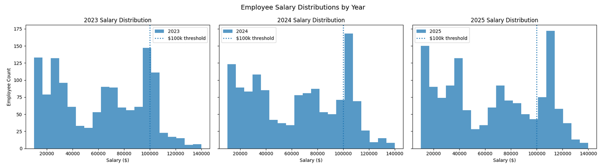
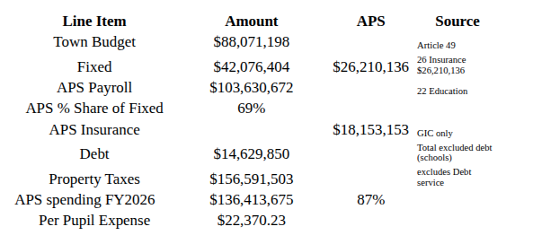

# Recent 8% Compounded Salary Expense in Arlington Public Schools is Unsustainable, APS Expenditures are 87% of Property Tax Levy  

tl:dr Arlington Public Schools&#x27; payroll expense grew 8.5% in FY2026.  All expenses attributed to the APS, including payroll, health care and debt exclusions total nearly 87% of the property tax levy.  

## Actual Vs Budgeted  

The FinCom report to Town Meeting details education (APS+Minuteman) spending that corresponds to the MA DOR Education line item in the General Fund expenses.  The DOR Education line item is the actual, audited amount spent for both the APS and Arlington&#x27;s share of the Minuteman spending.  We will see, the APS education line item in the FinCom report to TM is 95%+ payroll expenses; i.e. salaries.  

The table below details the fiscal year (FY2016 to FY2026), the Education line item from the DOR General Fund actual expenditures and the year on year percent change of the actual education expenditures in the first four columns.  Note how volatile actual education spending is.  Of course, the FY2026 actual spending is not yet available.  

The TM (Town Meeting) Minuteman and APS budgets are reproduced here from FinCom reports, the %Diff column is the difference between budgeted education expenses and the DOR actual. The TM% double column shows the year on year change in the APS - alone budget and the APS+Minuteman budget.  
  
  
| FY                    | DOR General Fund         | DOR %                  | TM Minuteman | TM APS       | %Diff  | TM % (APS)             | TM % (APS+MM)          |
| :----------------------| -------------------------:| -----------------------:| -------------:| -------------:| -------:| -----------------------:| -----------------------:|
| 2016                  | $57,662,017              | 5.38%                  | $4,010,950   | $53,574,114  | 0.13%  |                        |                        |
| 2017                  | $63,705,295              | 10.48%                 | $3,649,349   | $57,001,333  | 4.79%  | 6.40%                  | 5.32%                  |
| 2018                  | $65,109,595              | 2.20%                  | $4,291,333   | $60,928,485  | -0.17% | 6.89%                  | 7.53%                  |
| 2019                  | <mark>$65,792,139</mark> | 1.05%                  | $4,936,724   | $66,102,319  | -7.97% | 8.49%                  | 8.92%                  |
| <mark>2020</mark>     | <mark>$79,690,122</mark> | <mark>21.12%</mark>    | $5,384,690   | $71,427,139  | 3.61%  | 8.06%                  | 8.13%                  |
| 2021                  | $81,004,989              | 1.65%                  | $6,113,371   | $75,570,531  | -0.84% | 5.80%                  | 6.34%                  |
| 2022                  | $87,033,450              | 7.44%                  | $6,795,456   | $80,104,634  | 0.15%  | 6.00%                  | 6.39%                  |
| 2023                  | $91,353,298              | 4.96%                  | $7,947,939   | $84,447,869  | -1.14% | 5.42%                  | 6.32%                  |
| 2024                  | $98,738,122              | 8.08%                  | $8,932,916   | $88,947,334  | 0.87%  | 5.33%                  | 5.94%                  |
| 2025                  | $105,101,294             | 6.44%                  | $8,562,229   | $96,521,248  | 0.02%  | 8.52%                  | 7.36%                  |
| 2026                  |                          |                        | $8,443,856   | $103,630,672 |        | 7.37%                  | 6.65%                  |
| <mark>**CAGR**</mark> |                          | <mark>**6.90%**</mark> |              |              |        | <mark>**6.82%**</mark> | <mark>**6.89%**</mark> |
  
  
## Notes.  

The last line shows the CAGR (Compound Annual Growth Rate aka the average annualized change) for both actual and budgeted education expenses; both about 7%.    

Note that the year on year changes and differences between actual and budgeted are much more volatile; 0.02% most recently, to almost -8% in FY2019, but the annualized growth over a 10 year period are similar.  
  
Some may recall, that over longer lookbacks (20+ years) the DOR education expense CAGR was 5.8%, but has increased to 6.9% over the past 10 years.  

The highlighted rows for FY2019 and FY2020 are noteworthy.  Of course, this was the pandemic spending.  The actual increase in education expense from FY2019 to FY2020 was almost $14M (21%).  Note how the same increase in spending is presented in the budgets, as consecutive 8%+ increases.  

Note that the most recent two fiscal years (FY25 and FY26) budgeted payroll increases are 7.37% and 8.52%.  

One APS structural deficit is that $14M in increased spending in FY2020 using pandemic funds.  Staffing levels never returned to their long term trends after 2020 and the federal money dried up.  This decision compounds everywhere, not just in the Education line item, see health care expenses below.  

The APS actual growth expenditures have been less than 2% three times in the past decade.  After every override or special one time revenues (pandemic funds), it appears the APS increases staffing far above average (e.g. 10%, 21%), locking in higher compound growth rates for the future.  

FinCom should provide (1) CAGR summaries (5,10,20 year) and (2) actual vs budgeted reporting for all budgets.  

Payroll Expense  

Is this true &quot;the APS education line item in the FinCom report to TM is 95%+ payroll expenses; i.e. salaries.&quot;  ?  

Rob Spiegel/APS was kind enough (legally required) to provide me with the last 3 years of W2 earnings for each APS employee.  

The table below summarizes the APS W2 earnings.  Note that the W2 earnings are reported over a calendar year and care must be taken when comparing to fiscal year budgets and audited financials.  Calendar year 2025 spans the last half of fiscal year 2024 and the first half of fiscal year 2025.  The column 2Y Avg Budget is an average over the two consecutive years from our first table of APS budgets above.  
  
  
| Year      | W2 Earnings | YoY %      | Employees | YoY %     | 2Y Avg Budget | %W2 to Budget |
| :----------| ------------:| -----------:| ----------:| ----------:| --------------:| --------------:|
| 2023      | $82,615,234 |            | 1792      |           | $86,697,602   | 95.3%         |
| 2024      | $89,823,003 | 8.72%      | 1878      | 4.80%     | $92,734,291   | 96.9%         |
| 2025      | $95,193,653 | 5.98%      | 1931      | 2.82%     | $100,075,960  | 95.1%         |
| **Total** |             | **15.23%** |           | **7.76%** |               | **95.8%**     |
  
  
Notes  

- At least 95% of the Education budget line items is the APS payroll over the past 3 years.  
- The number of employees has increased almost 8% in two years, the actual payroll has increased 15%.  
- In 2025, 385 employees were paid over  $100K accounting for 46% of total W2  earnings, compared to 2023 when 210 employees earned more than $100K accounting for 28% of the total.  
- In 2025, 516 employees were paid under $10K accounting for 2% of the total W2 earnings, compared to 2023 when 486 employees earned under $10K, also about 2% of the total.  

Recall the discussion of the $10M addition to free cash each year; $6M or so from underestimating revenues and $4M or so from over estimating expenses.  If the &quot;Education&quot; line item in the APS budget is only payroll, then the $3M-$5M difference from the 2Y average budget may contribute about $4M per year to the free cash balance increases as over-estimated expenses.  

## Employee Salary Distributions for 2023 - 2025  

Below are histograms of the number of employees (2025 ~1200 employees) who earned between $10K and $140K in $20K buckets for each calendar year. Note the migration from 210 employees earning &gt;$100K in 2023 to the 385 in 2025.  

  

There are three distinct populations in the distributions of APS salaries.  Focusing on calendar year 2025, there are three groups:  

1. those earning less than $50K about 400 employees (new hires, turnover, teachers)  
2. those earning between $50K and $100K, about 450 employees (teachers, others)  
3. those earning &gt; $100K about 350 employees.  

Seasonal hiring practices are seen in (1) from the spread between fiscal year basis while the W2 earnings are on a calendar year basis and turnover which can be observed in the detailed payroll data.  

## Detailed Employee Payroll  

The highest paid employees in 2025 are listed in the table below for illustration of available columns provided by the APS.  
  

| Employee Name             | Work Location                       | Location                 | Job Class                             | 2023           | 2024           | 2025           |
| :--------------------------| :------------------------------------| :-------------------------| :--------------------------------------| ---------------:| ---------------:| ---------------:|
| Grand Total               | S77 - MAIL - SCH OUTSIDE            | S22 - SPECIAL ED         |                                       | $82,615,234.24 | $89,823,002.79 | $95,193,652.98 |
| HOMAN, ELIZABETH          | S35 - ADMINISTRATION                | S35 - ADMINISTRATION     | S001 - SUPERINTENDENT OF SCHOOLS      | $208,620.75    | $222,318.07    | $227,354.38    |
| JANGER, MATTHEW           | S01 - ARLINGTON HIGH SCHOOL         | S01 - HIGH SCHOOL        | S020 - P)  HIGH SCHOOL PRINCIPAL      | $187,519.45    | $192,991.62    | $194,607.73    |
| FORD WALKER, MONAKATELLIA | S35 - ADMINISTRATION                | S35 - ADMINISTRATION     | S002 - DEPUTY SUPERINTENDENT OF APS   | $97,093.11     | $180,440.26    | $183,685.24    |
| ELMER, ALISON             | S35 - ADMINISTRATION                | S35 - ADMINISTRATION     | S004 - ASST SUPT OF STUDENT SEVICES   | $172,374.32    | $174,795.14    | $179,686.98    |
| PIERRE-MAXWELL, FABIENNE  | S77 - MAIL - SCH OUTSIDE            | S04 - GIBBS              | S034 - P)  GIBBS PRINCIPAL            | $146,553.42    | $153,630.08    | $159,076.24    |
| DINGMAN, THAD D           | S10 - DALLIN ELEMENTARY SCHOOL      | S10 - DALLIN             | S045 - P)  DALLIN PRINCIPAL           | $142,040.49    | $160,343.43    | $157,991.70    |
| DONATO, KAREN             | S16 - THOMPSON ELEMENTARY SCHOOL    | S16 - THOMPSON           | S060 - P)  THOMPSON PRINCIPAL         | $142,140.61    | $151,206.90    | $153,926.22    |
| KELLY, AMY                | S15 - STRATTON ELEMENTARY SCHOOL    | S15 - STRATTON           | S065 - P)  STRATTON PRINCIPAL         | $74,999.99     | $151,206.90    | $153,926.22    |
| RUBINO, ROCHELLE M        | S05 - OTTOSON MIDDLE SCHOOL         | S05 - OTTOSON            | S025 - P)  OTTOSON MID SCHL PRINCIPAL |                | $75,957.83     | $153,744.36    |
| SPIEGEL, ROBERT           | S35 - ADMINISTRATION                | S35 - ADMINISTRATION     | S019 - DIRECTOR OF HUMAN RESOURCES    | $138,959.49    | $143,986.96    | $148,533.29    |
| GORSKI, FRANCIS           | S77 - MAIL - SCH OUTSIDE            | S35 - ADMINISTRATION     | S003 - ASST SUPERINTENDENT OF FINANCE |                | $76,232.34     | $146,856.49    |
| CREDLE-THOMAS, MARGARET M | S35 - ADMINISTRATION                | S35 - ADMINISTRATION     | S090 - DIR OF DEI, BELONGNG & JUSTICE | $129,510.46    | $142,228.93    | $143,881.22    |
| ETIENNE, WESLIE           | S33 - COMMUNICATIONS/FAM ENGAGEMENT | S35 - ADMINISTRATION     | S007 - DIR OF COMMUNICN & FAM ENGAGMT |                | $65,057.52     | $143,881.22    |
| TRAN, THAM                | S21 - PROFESSIONAL STAFF            | S21 - PROFESSIONAL STAFF | S496 - DIRECTOR OF FINANCE            |                | $10,727.96     | $141,934.89    |
| LINER, EVA T              | S06 - BISHOP ELEMENTARY SCHOOL      | S06 - BISHOP             | S035 - P)  BISHOP PRINCIPAL           | $67,500.03     | $141,086.21    | $138,533.57    |
| VICE, GRETCHEN            | S07 - BRACKETT ELEMENTARY SCHOOL    | S07 - BRACKETT           | S040 - P)  BRACKETT PRINCIPAL         | $65,999.96     | $133,390.79    | $136,453.49    |
| GREENWOOD, JEREMY         | S16 - THOMPSON ELEMENTARY SCHOOL    | S16 - THOMPSON           | S030 - ASSISTANT PRINCIPAL            |                | $50,635.40     | $135,389.54    |
| RAKOWSKY, DANIELLE        | S01 - ARLINGTON HIGH SCHOOL         | S23 - GUIDANCE           | SDBH - DOCTORATE 26 HIGH SCHOOL       | $131,013.63    | $129,023.09    | $135,386.69    |
| MORSE, TODD S             | S55 - AASP                          | S55 - AASP ADMIN         | S114 - DC)  ARL AFTER SCH PROG -DIREC | $124,388.92    | $125,465.04    | $134,617.34    |
| SAUNDERS, GRETCHEN        | S11 - HARDY ELEMENTARY SCHOOLS      | S11 - HARDY              | S050 - P)  HARDY PRINCIPAL            |                | $66,245.27     | $134,462.56    |
| ROTHENBERG, JENNIFER H    | S01 - ARLINGTON HIGH SCHOOL         | S25 - COMMUNITY          | S629 - C.E)  DIRECTOR OF COMM. EDUC.  | $129,750.92    | $133,045.98    | $133,894.23    |
  
  
No doubt, payroll information can be useful and better inform Town Meeting about the education budget.  

## Notes  

- No teachers in top 21 earners in the APS  
- There are 1931 employees in 2025, with 2719 different name/job combinations; e.g. a teacher is also a coach.  
- The top earners listed above account for about 4% of the 2025 payroll.  
- 385 employees earned more than $100K in 2025 representing 46% of the total payroll.  
- The bottom 516 employees earn under $10,000 per year and represent under 2% of the 2025 payroll.  
- How equitable is it that the top 21 earners in the APS (table below in next section) earn twice as much as the bottom 516 employees?  

***A longer history of payroll, ten years for direct comparisons to CAGR in budget and financial statement information, would be useful as would employee start and end dates for more accurate comparisons to fiscal year budgets.***  

## APS Appropriated Expenditures  

Now for the good stuff.  

We will refer to the [F]Y2026 FinCom report to Town Meeting Summary appendix C-1](https://www.arlingtonma.gov/home/showpublisheddocument/73684/638802179946530000), relevant line items copied in table below.  

Notes:  

- The APS share of 69% for the insurance assumes (1) Insurance is dominated by health care and (2) Town payroll is Town Budget - Fixed (insurance + retirement).  
- There is no appropriation for APS retirements.  
- Property taxes of $157M does not include debt exclusions for school buildings.  
- The APS total spending is payroll + debt service passed by debt exclusion overrides + 69% share of health care costs.  
- Other shared expenses between Town and School budgets such as IT and Facilities is not yet included.  

***Take away is that 87% of the property taxes (sans debt) collected is expended on the APS.***  

## Bonus  
  
Town officials have pointed to rising health care costs as reasons to increase property taxes.  The table below shows the last 10 years of insurance and retirement costs.  Note that the CAGR (average annualized growth) for insurance is 4.83%, well below the 6.9% increase in the APS payroll and when 70% of your insurance is experiencing 8% growth in staff in the last 2 years, well, no surprise insurance costs are rising.  
  
  
| FY       | Insurance   | Retirement  | YoY % (Insurance) | YoY % (Retirement) |
| :---------| ------------:| ------------:| ------------------:| -------------------:|
| 2016     | $16,359,582 | $9,053,241  |                   |                    |
| 2017     | $16,920,564 | $9,554,782  | 3.43%             | 5.54%              |
| 2018     | $17,239,561 | $10,086,413 | 1.89%             | 5.56%              |
| 2019     | $17,159,100 | $10,747,527 | -0.47%            | 6.55%              |
| 2020     | $17,891,836 | $11,337,478 | 4.27%             | 5.49%              |
| 2021     | $18,858,788 | $11,902,771 | 5.40%             | 4.99%              |
| 2022     | $20,212,725 | $12,616,206 | 7.18%             | 5.99%              |
| 2023     | $21,772,313 | $13,367,833 | 7.72%             | 5.96%              |
| 2024     | $22,077,822 | $14,133,735 | 1.40%             | 5.73%              |
| 2025     | $23,241,930 | $14,994,696 | 5.27%             | 6.09%              |
| 2026     | $26,210,136 | $15,866,268 | 12.77%            | 5.81%              |
| **CAGR** |             |             | **4.83%**         | **5.77%**          |
  

## Conclusions  

- The property tax model for funding education is broken.  
- The Education line items in budgets and financial statements are payroll.  
- Actual payroll spending is volatile.  
- Payroll (including adds to staff) increases more than 10% immediately following overrides.  
- Pandemic funding was used to increase the APS payroll by 21% ($14M) and never lowered after the pandemic funding ended.  
- APS staffing has increased by 8% over the past two years, while salaries increased 15% over the past two years.  
- Health care costs are not the main driver of the APS budget deficit.  
- APS totals spending (debt + payroll + GIC) is budgeted at $136M compared to $157M in property taxes or 87%  

The last conclusion, of course, ignores state funds (Chapter 70) and other revenue sources, but the scale of spending and CAGR is key to understanding the first conclusion.  