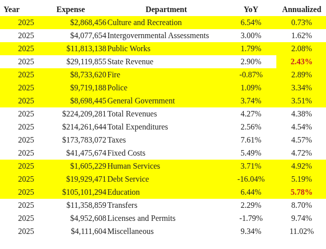
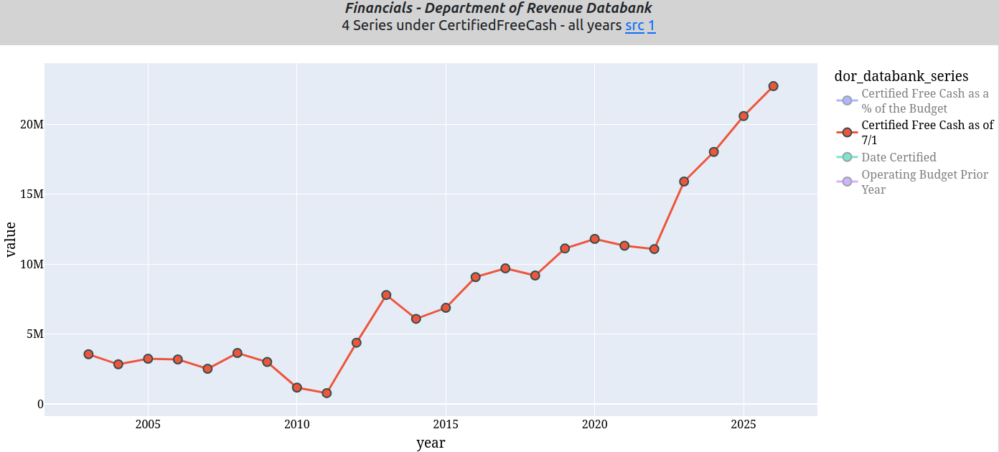
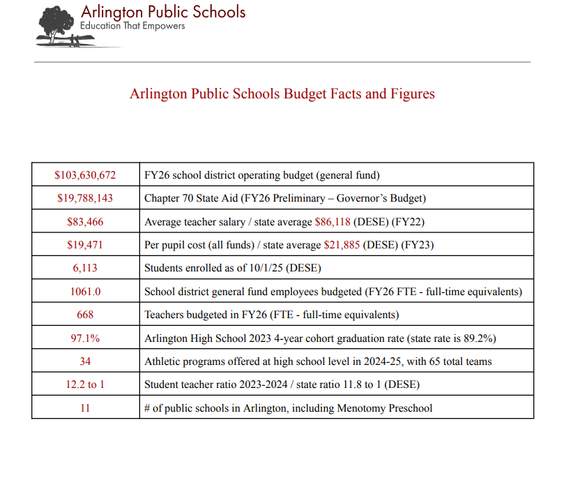
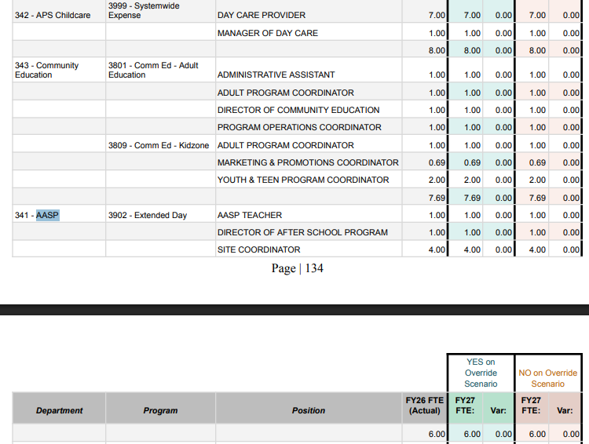
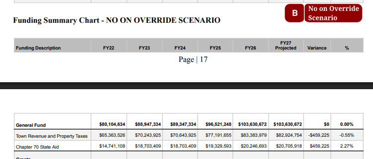

# Summary   
  
&quot;Politics is the art of the possible&quot; - Otto von Bismark  

Over the past six weeks, we explored some truths about the structural financial defects in the Arlington Public Schools, listed, summarized and linked below.  Follow the links for detail of each section.  

***tl;dr APS spending is unsustainable with no justification amid decreased enrollments resulting in repeated, unnecessary, humongous overrides making Arlington unaffordable.***  

## 1/16/26 [School Enrollment 1.41% Average Annual Increase, School Spending 5.78% Average Annual Increase](../APS-enrollment-v-spending/APS-enrollment-v-spending.md) 

Police, Fire, DPW all stay within budget.  Education is the budget buster.  

  

    
    
<em>Education Spending Dominates</em>

  

  

    
    
<em>General Fund Expenses</em>

  

  

## 1/21/26 [APS Enrollment Decline K-2](../APS-enrollment-decline-K-2/APS-enrollment-decline-K-2.md)  

APS Enrollment has peaked, declining in K-2 last 5 years and over the foreseeable future.  
  
  

Kindergarten trend in enrollments next four years:  

children born between:  
254  9/1/2020 - 8/31/2021 ages 4.5 - 5.5  
281  9/1/2021 - 8/31/2022 ages 3.5 - 4.5  
269  9/2/2022 - 8/31/2023 ages 2.5 - 3.5  
292  9/2/2023 - 8/31/2024 ages 1.5 - 2.5  

Current K enrollment 429  

Pre-school enrollments decreased from 100 to 79 in 2026, a 21% decline.  

## 2/4/26 [Underestimating Revenues and Overestimating Expenses to Support an Unnecessary Override](../Underestimating-revenues-and-overestimating-expenses-to-support-an-unnecessary-override/Underestimating-revenues-and-overestimating-expenses-to-support-an-unnecessary-override.md)  

Free cash balance explodes!  10% of budget, $22M+ balance.  

  

## 2/11/26 [Recent 8% Compounded Salary Expense in Arlington Public Schools is Unsustainable](../Recent-8-percent-Compounded-Salary-Expense-in-Arlington-Public-Schools-is-Unsustainable-APS-Expenditures-are-87-percent-of-Property-Tax-Levy/Recent-8-percent-Compounded-Salary-Expense-in-Arlington-Public-Schools-is-Unsustainable-APS-Expenditures-are-87-percent-of-Property-Tax-Levy.md)  
  
Expenses dominated (85%) by an expanding payroll with a 7% CAGR, but we have no control over expenses because of inflation?  

  

## 2/15/26 [History of Overrides](../History-of-Overrides/History-of-Overrides.md)  

Arlington&#x27;s $14.8M override will be the largest in MA history.  Arlington will have 5 of the top 25 overrides in MA history!  

  

## 2/24/26 [Budget Fudge It](../Budget-Fudge-It/Budget-Fudge-It.md)  

APS budget presentations are misleading with key metrics subject to revision and inconsistent with DESE standards.  
  
  

## 2/25/26 [Fee Revenues from AASP and Community Education](../Fee-Revenues-from-AASP-and-Community-Education/Fee-Revenues-from-AASP-and-Community-Education.md)  

APS stonewalls simple public records request.  Where did $4M go?  
  
  

## 3/10/26 [Trust, easily lost, never recovered](../Trust-easily-lost-never-recovered/Trust-easily-lost-never-recovered.md)  

The APS maintains at least 3 sets of ledgers with minimal oversight co-mingling the funds  

  - $136M+ Town Meeting appropriation  
  - $26M+   Chapter 70/grant revenues  
  - $4M+     unreported revolving funds (AASP and Community Education)  

Jeffrey Skilling would be proud!  

  

&quot;Politics is the art of whatever you can get away with&quot; - Arlington officials  
