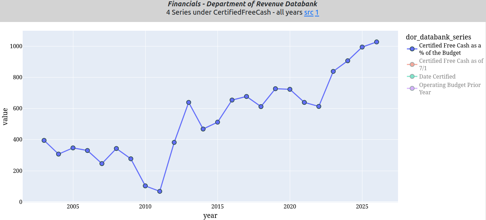
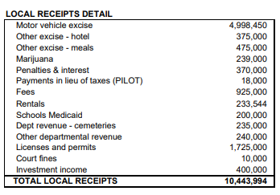
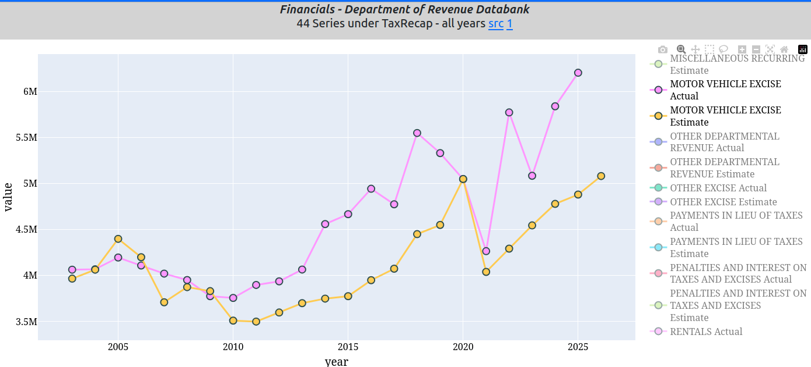
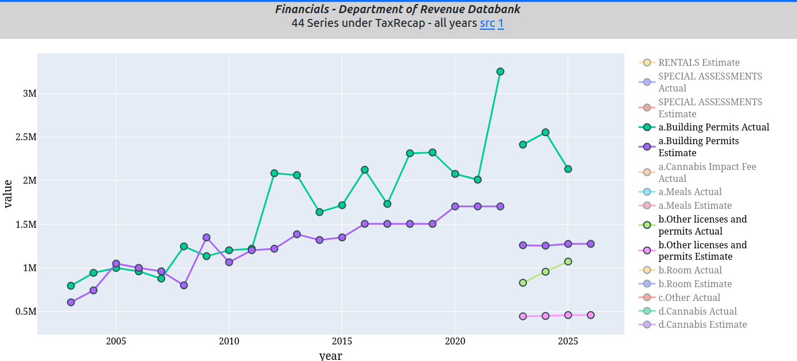
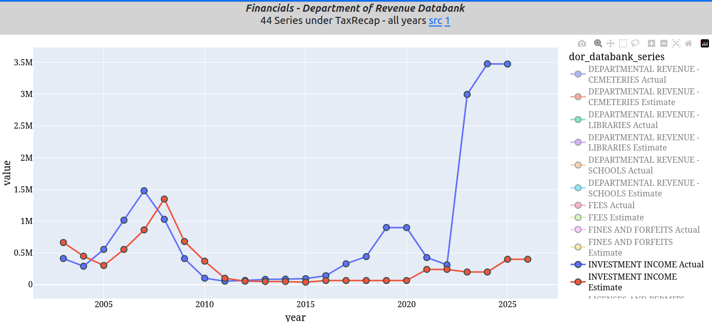
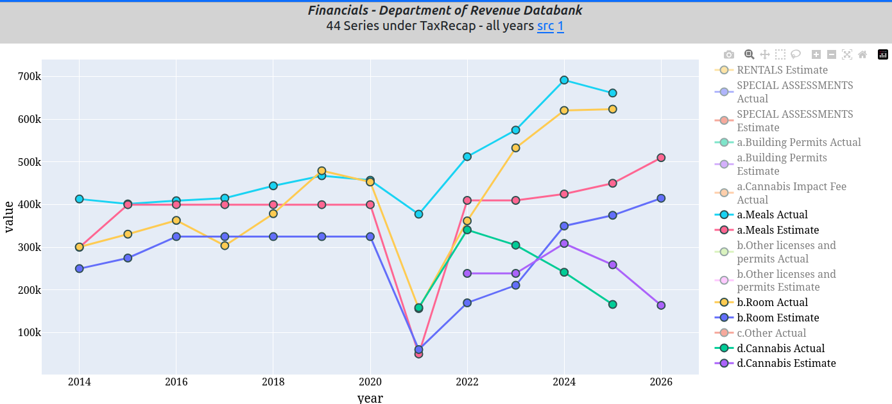
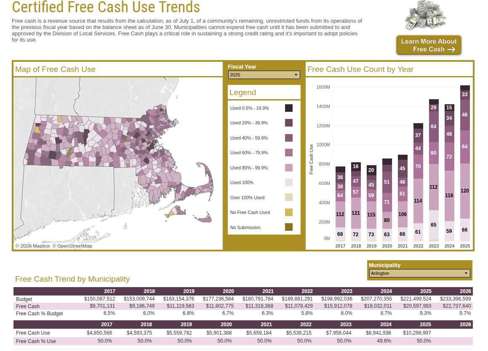
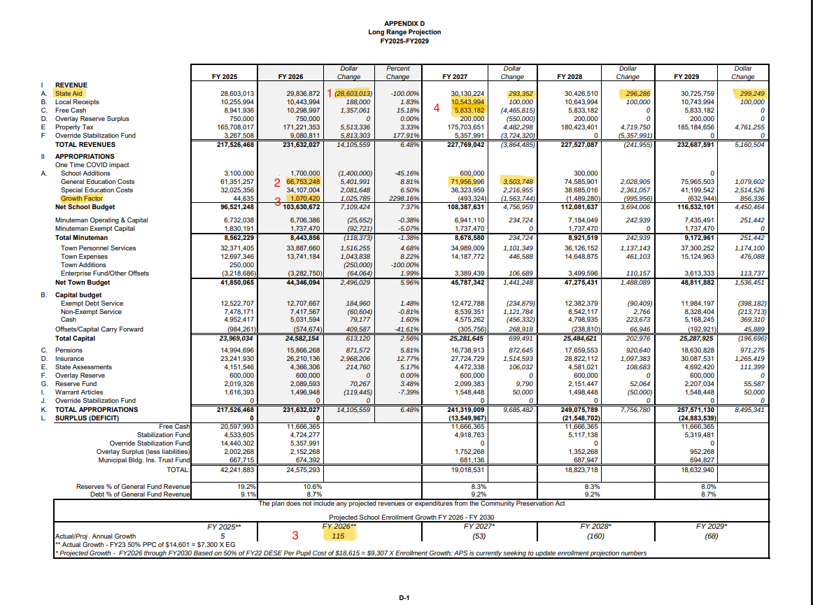
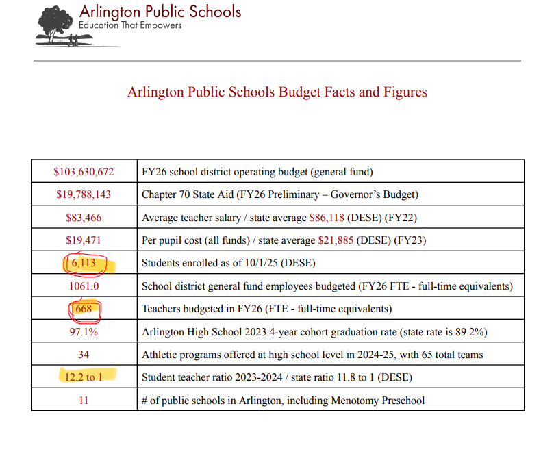

# Underestimating revenues and overestimating expenses to support an unnecessary override  
  
***tl:dr Underestimating revenues and overestimating expenses creates a phantom budget deficit.  Accurate revenue recognition and a 7% free cash to budget ratio eliminates the FY2027 budget deficit; no cuts required.***  

## What is Free Cash?  

Free Cash in Massachusetts municipal finance refers to the unrestricted, unappropriated funds carried over from the previous fiscal year’s operations.   It is calculated as of July 1 each year based on the town’s balance sheet as of June 30, and is certified by the Division of Local Services (DLS) after the state reviews the prior year’s financial reports.  It typically includes:  
  - Actual revenues exceeding budgeted amounts.  
  - Unspent funds from departmental budget line items.  
  - Unexpended free cash from the prior year.  

The Financial Management Resource Bureau (FMRB) recommends maintaining free cash at 5% to 7% of the annual operating budget to ensure fiscal stability and support strong bond ratings.  

Below are two charts detailing (1) the percentage of free cash to budget (in basis points 1000 = 10%) and (2) the balance of Arlington&#x27;s free cash (most recent $22M) from FY2003 to FY2026.  

  

    
    
<em>Free Cash Percent of Budget</em>

  

  

    
    
<em>Free Cash Balance</em>

  

  
The first chart (basis points on y-axis) shows that the most recent free cash balance is 10% of the Town&#x27;s budget, or about $22M on a $230M budget.  Note that at a 10% free cash to budget ratio, Arlington&#x27;s free cash is well over the FMRB recommendations quoted above.  Each 1% change in free cash is about $2.3M.  

On the second chart, from 2003 - 2011 or so, free cash was relatively constant and under 4% of budget, and starting in 2014, free cash has increased, just about every year, with a remarkable increase in 2023 when interest on MSRB funding of AHS was collected, see Investment Income chart in the Local Receipts section below.  

Free cash is available for appropriation in subsequent fiscal years and has seen about $8M in FY2024, $9M in FY2025 and $10M in FY2026 added to the revenues side of Town Meeting appropriations, leaving a starting point of more than $13M (&gt;5% of budget) available in FY2027 PLUS any underestimated local receipts and overestimated expenses (padding) from FY2026, estimated at another $10M or so.  

You will notice, that although $8M - $10M has been transferred to appropriations each of the last 3 years, the balance of the free cash account has increased, suggesting between 3% and %5 of the budget is underestimated revenues PLUS over estimated expenses combined running about $8M to $10M per year.  

Let&#x27;s show where $10M of revenues and inflated expenses are not being recognized in budgeting or financial reporting of budget deficits as support for a Prop 2.5 override.  

## Underestimate Revenues  

The dominant reason free cash increases every year is that Local Receipts have been consistently underestimated.  The annual [Finance Committee report to Town Meeting, in Appendix C-1](https://www.arlingtonma.gov/home/showpublisheddocument/73684/638802179946530000) under the section &quot;Local Receipts Detail&quot; for FY2026 is copied below:  

  

The largest line items are motor vehicle excise tax, permits, investment income and various local option taxes - meals, rooms, pot.  

### Motor Vehicle Excise Tax  

Below is a chart of the Motor Vehicle Excise Tax estimated in the annual Town Meeting FinCom report used for the available revenue for appropriations.  The yellow line is the estimated amount, while the pink line is the actual amount.  Note that from 2003 - 2011 or so, the estimated excise taxes and the actual collected excise taxes were aligned.  For the past 12 years, excluding the pandemic, excise tax estimates (yellow) provided to Town Meeting for appropriations trails the actual collected (pink) by an average of  

In FY2025, the latest available, the Town Meeting FinCom report estimated just under $5M, which was appropriated, while the actual amount was $6.2M.  The more than $1M difference mostly ends up as free cash.  

  

### Permits and Licenses  

Below is a chart of the Permits and License fees estimated in the annual Town Meeting FinCom report used for the available revenue for appropriations.  The green lines are the estimated amount, while the purple lines are the actual amount.  Note that from 2003 - 2011 or so, the estimated permit and license fees and the actual collected permit and license fees were aligned.  For the past 12 years, excluding the pandemic, permit and license fee estimates (purple) provided to Town Meeting for appropriations trails the actual collected (green) by an average of about $1.5M each year for the past 15 years.  The discontinuity in 2023 is the result of name changes to these funds by the MA Department of Revenue.  
  
  

In FY2025, the latest available, the Town Meeting FinCom report estimated just under $1.8M, which was appropriated, while the actual amount collected was $3.2M.  The almost $1.4M difference mostly ends up as free cash.  

### Investment Income  

Below is a chart of the Investment Income estimated in the annual Town Meeting FinCom report used for the available revenue for appropriations.  The red line is the estimated amount, while the blue line is the actual amount.  Note that from 2003 - 2021 or so, the estimated investment income and the actual income were aligned.  For the past 3 years, investment income estimates (red) provided to Town Meeting for appropriations trails the actual collected (blue) by an average of about $3M each year for the past 3 years.  Note, the first time a substantial reserve account had excess investment income, the 2005 - 2009 period, the estimates and actual tracked well with just a one year lag.  Apparently, Arlington abandoned this financial management tool after the 2011 override.  

Note well, the $3M bump in Arlington&#x27;s investment income was the result of the substantial MSRB balances expended for the new AHS building and are expected to drop, unless a new override is approved for FY2027.  
  
  

### Local Options Taxes - meals, rooms, pot  

Below is a chart of 3 local option taxes estimated in the annual Town Meeting FinCom report used for the available revenue for appropriations.  This chart is more challenging to read, but the differences are clear, estimates almost always lag actual amounts, in this case by about $500,000 per year.  Funny how Local Receipt estimates are always much lower (20%+) than actual since 2011.  

  

In general, Arlington underestimates the local receipts revenues by $6M - $7M per year growing by about $2M per year over the past five years.  Targeting 7% free cash to budget (the upper end of the suggested limit) would free up about $6M per year and lower the FY2027 projected budget deficit.  
  
***FinCom needs to update its estimates for local receipts to a more realistic level.***  

## DOR Trends in Free Cash  

While local receipts add about $6M a year in underestimated revenues, overestimated expenses add another $3M - $4M per year over the past three years or so.  This is evidenced by the below graphics from the MA Department of Revenue in the table on the bottom &quot;Free Cash Trend by Municipality, selected for Arlington.  

  

Note that from 2017 - 2022, free cash was about $11M and was 6% to 7% of the budget, but starting in 2023 rose to 8% and is now at 10% of the budget.  Our S&amp;P credit ratings were the same with free cash at 6% of the budget as they are at 10%.  

## Overestimate Expenses  

Below is the &quot;Long Range Projection&quot; in appendix D-1 in FinCom&#x27;s FY2026 report to Town Meeting showing the more than $13M budget deficit projected for FY2027.  Let&#x27;s look closely.  
  
  

I&#x27;ve highlighted 4 line items of interest numbered and highlighted in yellow with footnotes below.  

1. Under Revenue A. State Aid, the highlighted Dollar Change column is obviously incorrect and should be about $1.2M.  The projections for the next three subsequent years, increases of about $300k is just a 1% annual increase in state aid.  As we all  know, state aid has increased an average of 2.43% per year over the past two decades, and in fact the Governor&#x27;s FY2027 initial state aid proposal for FY2027 is 2% or closer to $600K, and traditionally is increased by the legislature.  A more realistic and conservative estimate would be a $600K - $1M increase in state aid for each of the next three fiscal years.  

2. Under II Appropriations A General Education Costs, the highlighted Dollar Change between FY2027 ($72M) and FY2026 ($67M) is reported as $3.5M.  Not just sloppy, but the subtotal is correct because the School Additions line item change (-$1.1M) is incorporated into the General Education line item masking an almost 8% increase in general ed funding in FY2026.  Not just sloppy by deceptive.  

3. Under II Appropriations A the Growth Factor line item shows $1M increase predicated on the FY2026 enrollment growth of 115 students, when in fact DESE reports that enrollment in FY2026 decreased by 15 students.  Over the past 7 years, the enrollment growth factor reported to Town Meeting exceeds the actual enrollment growth by almost 200 students, or an over-estimate of about $300K per year in APS expenses.  Projections of future K enrollment decreases far exceed what is projected in this report.  

4. Again in Revenues, line item B Local Receipts indicate a minimal increase of $100K holding steady at about $10M, when in fact, we know from the sections above, this is underestimated by approximately $6M.  As well, the highlighted expected free cash transfer is projected to drop from $10M in FY2026 to $5.8M for the next 3 years, even though free cash, and the historic 50% transfer rate, indicates that for FY2027, at least, the free cash transfer will be more than $10M.  

The long term projection report is sloppy, misleading, under estimates revenues and over estimates expenses by over $12M for FY2027. Merely by limiting free cash to the historic 5% - 7% recommended target and recognizing both revenue and expenses in more defensible, realistic, accurate manner reveals there is no FY2027 deficit.  

***There is no need for an override in FY2027.***  

## Conclusion  

In equity markets, unscrupulous managers inflate revenues and under report expenses to boost their stock price which is a criminal offense.  In municipal finance, the opposite financial manipulations occur by under reporting revenues and inflating expenses to advocate for increased taxation which while not criminal is the same type of deception and financial chicanery.  

Is it too much to ask for well presented, accurate financial reporting before seeking an override?  

## Bonus   
Below is a copy of the [APS overview presented to Town Meeting last year](https://www.arlingtonma.gov/home/showpublisheddocument/74114/638822069279670000).  Notice the mistake?  Not just sloppy, but it is appalling that dozens of MIT grads on Town Meeting fail to recognize that 6113 / 668 != 12.2   That new math I never learned.  
  
  