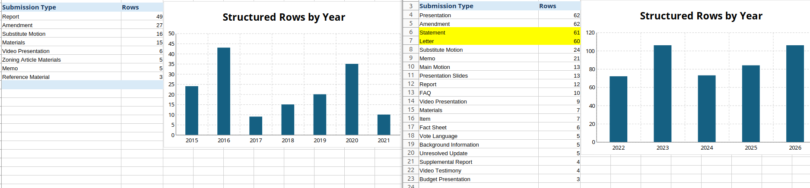

## Question

Is Arlington’s resident-access structure for electronic Town Meeting advocacy constitutionally vulnerable, and what is the narrowest remedy?

### Dispute

Arlington’s post-COVID Town Meeting communication system gave elected officials and insiders reliable access to a Town-controlled channel while forcing dissenting residents into sponsor dependence, subjective Moderator review, private-email BCC workarounds, and mass blocking. The problem is not that officials disagreed with Harrington. The problem is that the Town maintained a communication architecture that predictably filters disfavored resident advocacy before it reaches the legislative body.

After Arlington Town Meeting moved into electronic processes, resident access to Town Meeting became dependent on insider permission, Moderator discretion, and unstable private-email workarounds.

### Remedy

The Town should provide a neutral, durable resident-access mechanism integrated into the same Town-controlled communication system used for TMM, official, and other warrant-related advocacy. Any Arlington resident should be able to submit written material concerning a pending warrant article for inclusion alongside other correspondence and advocacy in the article-specific Annotated Warrant archive, with notice or distribution to TMMs through the same email-list, digest, or link process used for other submissions. The Town may impose reasonable, viewpoint-neutral rules governing timing, length, format, duplication, malware, privacy, true threats, and non-germane commercial material, but resident access should not depend on a TMM co-sponsor or subjective review for tone, civility, criticism of officials, or undefined “appropriateness.” Any rejection should be in writing, identify the specific rule and factual basis relied upon, and be preserved in a publicly accessible disposition log. This preserves the Town's ability to administer its communication infrastructure while ensuring that resident advocacy is neither segregated into a lesser channel nor conditioned on an intermediary's approval.

## Background

### Arlington Officials

Below is a list of Arlington officials referenced in this document.

- Greg Christiana - Arlington Town Moderator 4/2022 ("Christiana")
- James Feeney - Arlington Town Manager 2023 ("Feeney"), Public Records Officer 2022-2023 ("Feeney")
- Michael Cunningham - Arlington Town Counsel 9/2024 ("Cunningham")
- Juli Brazile - Arlington Town Clerk ("Brazile")

Former Arlington officials:

- Douglas Heim -  Andover Town Counsel, former Arlington Town Counsel 2014 - 9/2023 ("Heim")
- Adam Chapdelaine - former Arlington Town Manager 2012 - 6/2022 ("Chapdelaine")

On April,2 2022 Google engineer Christiana defeated the incumbent Town Moderator, lawyer John Leone, becoming the new Town Moderator. See [2022 Election Results](https://www.arlingtonma.gov/home/showpublisheddocument/60893/637865871993200000)

### Terms

- Town Meeting ("TM")
- Town Meeting Member ("TMM")
- Annual Town Meeting ("ATM")
- Special Town Meeting ("STM")

Annotated Warrant ("aWarrant") - derived from [statuatory Town Meeting Warrant](https://malegislature.gov/Laws/GeneralLaws/PartI/TitleVII/Chapter39/Section10) ***under the hands of the selectmen***.  The aWarrant is under the control of the Town Moderator.  The aWarrant provides the recommended vote, links to town maintained documents, TMM motions, amendments, presentations, correspondence from the public and various announcements.  The aWarrant is used for all TM article debate and management.  See for example [https://www.arlingtonma.gov/town-governance/town-meeting/2022-town-meeting-warrant](https://www.arlingtonma.gov/town-governance/town-meeting/2022-town-meeting-warrant)

Town Meeting Member Email List ("TMM_Email_List") - communication platform and manual portal for notice of aWarrant updates as well as year round announcements from Town Moderator, TMMs and Committees.  See for example [https://www.arlingtonma.gov/town-governance/town-meeting/members-email-list](https://www.arlingtonma.gov/town-governance/town-meeting/members-email-list).

Town Meeting Tracker ("TM_Tracker") - live spreadsheet with links to warrant articles and status/vote results.  

From the TMM_Email_List:

> "The Moderator makes the final determination about what is appropriate to include in [TMM] Emails.  Information about how to submit items for this email list or for the Annotated Warrant can be found in the Town Meeting Guidelines. Questions about these processes and policies should be directed to the Town Moderator."

### ATM2022 - Concerns of Public Access

Christiana conducted the 2022 ATM as a virtual Town Meeting using zoom and electronic communications in place of a physical meeting at Arlington Town Hall.  The meeting commenced on April 26, 2022.

On 04-24-2022, before Town Meeting commenced, Harrington emailed Christiana and Heim questioning how Town Meeting would accommodate petitions by members of the general public under the virtual Town Meeting format proposed by Christiana.  Christiana responded directing Harrington to email Christiana with petitions. Christiana would review for relevance and appropriateness, required authorship for accountability and would forward to town staff for inclusion. See Exhibit [A1](20220424_Town_Meeting_Petitions_by_Ordinary_Citizens.pdf)

On 04-25-2022 Harrington requested Christiana forward advocacy to the TMM_Email_List urging members to "Vote NO on continuing Remote Town Meeting due to lack of public accommodation".  See Exhibit [A2](20220425_Vote_NO_on_continuing_Remote_Town_Meeting_due_to_lack_of_public_accommodation.pdf).

Some TMMs thanked Harrington for his Letter, some requested Harrington to not email them.  See Exhibit [A3](20220425_Responses_to_First_Email_to_TM.png).

There is no record of Exhibit A2 in the TMM_Email_List or in the aWarrant archives.

On 04-26-2022 Christiana put forward a vote at the start of Town Meeting to adopt remote sessions barring debate on the merits. See Exhibit [A4](20220426_TM_transcript.md) or [url](https://youtu.be/BE3ZfLD8ano?si=Qns3JjT3f1HgzXA-&t=908)

On 04-26-2022 Harrington wrote a complaint to the Massachusetts Attorney General's office [A7](20220426_Public_accommodation_for_Arlingtons_2022_Virtual_Town_Meeting.pdf).  There was no response.

In 2022, Arlington did not merely choose a remote meeting format. Arlington chose a controlled electronic speech architecture. Harrington warned that the architecture would burden residents’ ability to petition and inform Town Meeting. That warning was not distributed through the official channel as resident advocacy. When the Meeting voted on whether to proceed remotely, the Moderator expressly barred debate on the merits and allowed only procedural questions. The later co-signer requirement, Moderator review for “appropriateness,” public-list blocking, and private-channel deliberation were not accidental side effects; they were the foreseeable operation of the controlled system Harrington had objected to at the outset.

The very system that restricted resident speech was adopted through a process in which objections to the system were themselves restricted.

Arlington provided an incomplete TMM contact list prior to 2022 and continues to do so today.  Many TMMs complained about receiving Harrington's advocacy through private emails from the very beginning; other TMMs thanked Harrington.  See Exhibit [A5](20220426_TMM_messages.png)  and [A6](20220426_TMM_Support_of_Notes.png)

When Arlington replaced the ordinary physical avenues for communicating written advocacy to Town Meeting with a Town-controlled electronic system, the new Moderator immediately asserted personal authority to screen resident submissions for ‘relevance and appropriateness’ and to require authorship for ‘accountability.’ When a resident challenged that authority and asked the Town to distribute opposition to the remote system itself, the advocacy was not distributed. The later co-sign requirement added an intermediary gate to that preexisting system of discretionary Moderator review.

## ATM2022

### Article 16 REGULATIONS FOR GAS POWERED LEAF BLOWERS

Harrington's concern with the ability of the general public to petition Town Meeting was due to inclusion of Article 16 in the 2022 Annual Town Meeting.  Harrington had spent many hours advocating before Town Meeting for residential exceptions on any ban of leaf blowers, was directly impacted by any such ban and was concerned Town Meeting would ban residential use of leaf blowers.

On 04-27-2022 Christiana posted on the TMM_Email_List a notice by "Quiet Healthy Arlington" on [Article 16](https://arlington.novusagenda.com/Agendapublic/CoverSheet.aspx?ItemID=13569&MeetingID=1564).  [The presentation](https://www.arlingtonma.gov/home/showdocument?id=60851&t=637864848891530000) only identifies the advocates' website (quiethealthyarlington.org) currently not reachable. See Exhibit [B1](20220427_Article_16_Leafblowers_QuietHealthyArlington.png). The presentation included no authorship.  Further investigation confirms that the authors were Anne Goodwin and Alicia Russell, neither of whom were Town Meeting Members at that time [B11](https://www.arlingtonma.gov/home/showpublisheddocument/60877/637865672426200000).  Note that the prevailing and current TMM_Email_List guidelines do not grant resident proponents access without a TMM co-signer.

On 05-02-2022 Harrington emailed Christiana advocacy entitled "Vote NO on Article 16 Leaf Blower Ban" requesting Christiana post the email to the TMM_Email_list.  See exhibit [B2](20220502_Vote_NO_on_Article_16_Leaf_Blower_Ban.pdf).  Harrington had a long and documented advocacy against regulations proposed in Article 16.  See Exhibit [B3](https://www.arlingtonma.gov/home/showpublisheddocument/9884/635278830672770000).

Harrington's Letter is not included in the [2022 aWarrant](https://www.arlingtonma.gov/town-governance/town-meeting/2022-town-meeting-warrant) or on the TMM_Email_List, See exhibit [B4](20220500_Article_16_Leafblowers_aWarrant.png) or click thru [Arlington Documents](https://arlington.novusagenda.com/Agendapublic/CoverSheet.aspx?ItemID=13569&MeetingID=1564).

More Town Meeting Members complained about receiving Harrington's advocacy.  Most copied Christiana.  On May 2, 2022 TMM David Levy wrote to Harrington and Christiana

> "... remove me from your mailing list? (I)f town moderator Greg believes it should be posted, I'll read it from that list" [B5](20220502_Dave_Levy.png)

The Levy email from May 2, 2022 exposes the flaw with the private email advocacy the Town provided. TMM Nora Mann's message [B6](20220502_Nora_Mann.png) confirms that email blocking took place immediately.  Private communications exposed Harrington to trolling and personal invective, e.g. Justice Democrats.  See Exhibit [B7](20220502_Justice_Democrats.png).  

Christiana knew or should have known as early as May 2, 2022 that relying on private communications with public bodies created barriers to advocacy from the general public.

The April 26 distribution triggered immediate resistance from some TMMs, including opt-out demands, blocking, and claims that the advocacy was disrespectful or hostile. TMM responses to Harrington's private communications shows that direct resident emailing was socially and technically unstable, while the official alternative was subject to Moderator discretion. That combination created a structural barrier to unpopular resident speech.

### Article 38 - co-sign Requirement

The TMM_Email_List guidelines were established under Leone before 2015 and the guidelines as of March 3, 2022 included "General materials relevant to a Warrant Article, such as we find on our chairs, should be submitted ..."  These were the same guidelines as of May 2, 2022.  See Exhibit [C1](20220303_TMM_Email_List_guidelines.png).

On May 16, Christiana changed TM's electronic submission guidelines, after consultation with the Town Clerk and Town staff, to include a requirement that all public communication to the TMM_Email_List or aWarrant be co-signed by a TMM.  See Exhibit [C2](https://www.arlingtonma.gov/Home/Components/News/News/12171/3819).

> "Town Meeting Members may submit materials that they have co-signed with residents."  As well, materials containing images needed to be in pdf or similar format.  See Exhibit [C2](20220926_TMM_Email_List_guidelines.png)

On May 17, 2022 Harrington requested TMM Kristin Anderson ("Anderson") to co-sign his Article 38 advocacy. Anderson had thanked Harrington for a social media post with materially the same contents. She agreed.  Anderson wrote to Christiana and Brazile the same day for clarification:

> "Stephen Harrington's odd request", "...maybe he's asking me to do something shady?", "Know that I have never agreed with Mr. Harrington about anything.","...he has my permission...as long as he's civil." See Exhibit [C3](20220517_Anderson_Christiana_Brazile.png).

On May 23, 2022 Harrington contacted Christiana not seeing the "Vote NO on Article 38" advocacy dessiminated on the TMM_Email_List.  See Exhibit [C4](20220523_Article_38_No_Anderson_submission.pdf)

On May 25, 2022 Harrington initiated an email exchange with Anderson from approximately 8:00AM through the 10AM TMM_Email_List submission deadline.  Anderson wanted several changes to Harrington's advocacy for civility [C4S](20220525_Article_38_Anderson_email_chain.png).  When Harrington refused she wanted to write a "cover letter" disavowing Harrington's opinion and insinuating Harrington intended to sue Arlington for speech violations.  See Exhibit [C51](20220525_Anderson_5.png)

On May 25, 2022 Harrington requested TMM Joe Kerble to co-sign the same advocacy on Article 38 before the May 25 10:00AM deadline.  Kerble did so.  Christiana responded:

 > The comment in the letter about a "financial gadfly turned elected official" is a step beyond what I'd normally consider appropriate for these submissions, but in this case I'll make an exception given the challenges Stephen has had getting his submission submitted.  See Exhibit [C6](20220525_VOTE_NO_ARTICLE_38_Christiana_Content.pdf)

Harrington’s germane opposition advocacy reached Town Meeting only after passing through a TMM intermediary and Moderator content review. The dispute over ***civility*** became inseparable from access to the public body. Public access to a legislative body should not depend on whether a neighbor is willing to attach their name, reputation, and comfort level to a resident’s advocacy.

The documents support a serious concern that Arlington’s electronic Town Meeting submission process allowed officials and intermediaries to burden disfavored resident speech under the labels of civility, appropriateness, and co-signing. The record shows ample basis for officials and TMMs to find the advocacy unpleasant. It does not show a basis for officials to suppress germane public-policy advocacy through discretionary “appropriateness” or co-signer filters.

### Slack Channel

TMM Daniel Jalkut ("Jalkut") created a Town Meeting Slack channel and TMMs distributed join-up links to precinct members.  One TMM forwarded Harrington that link.  Harrington joined.  Jalkut removed both Harrington and the TMM from the TMM slack within minutes.  Jalkut states the discussions, comments and posts of the TMM Slack should not be available to the public.  Several TMMs complained to Christiana and Heim about the Slack forum.

May 25, 2022 TMM Mark Kaepplein ("Kaepplein") forwards TMM Slack join link to Harrington at 5:50PM.  See Exhibit [C1](20220525_Kaepplein_Slack_Removal.png)

May 25, 2022 Harrington joins Jalkut's Slack channel and is removed within 5 minutes around 6:00PM.  Jalkut and TMMs Adam MacNeill and Lisa Bielefeld comment on Harrington's removal.  Jalkut wrote:

> "I don't believe what anything anybody discusses in here should be subject to direct scrutiny by the general public."

May 25, 2022 Kaepplein is removed from the slack by 7:51PM. See Exhibit [C1](20220525_Kaepplein_Slack_Removal.png)

TMM Adam MacNeill wrote:

> "Harrington has a long history of harassing and attempting to intimidate people, especially women". See Exhibit [C2](20220526_Daniel_Jalkut_and_Slack_Adam_McNeill.pdf)

May 25, 2022 TMM Annie LaCourt criticizes Kaepplein and uses emojis that suggested violence while TM was in session.  See Exhibit [C2](20220526_Daniel_Jalkut_and_Slack_Adam_McNeill.pdf)

May 26, 2022 Harrington demands Jalkut remove McNeill slur.  See Exhibit [C2.1](20220526_Jalkut_demand.png)

May 27, 2022 Christiana posts to the TMM_Email_List at 6:32PM concerning the Slack channel.  See exhibit [C3](20220527_TMM_Email_List_Slack_comments_by_Christiana.png)

May 27, 2022 TMM Daniel Jalkut ("Jalkut") announces his privately owned channel to Christiana, Chapdeliane and Heim at 9:19PM. See Exhibit [C4](20220527_Jalkut_Unofficial_Arlington_Town_Meeting_Slack.pdf).

> We have had really good luck so far with only Town Meeting Members using the invitation links, with the exception of one person who I had to remove from the Slack.  

May 31, 2022 TMM Michelle Desmond wrote to Christiana, Heim and Chapdeliane complaining about the Slack channel. See Exhibit [C5](20220531_Desmond_Slack_Channel.png)

> "Why is this channel allowed during the meeting...", "After hearing about this I wanted to quit town meeting", "many are afraid to say anything as they feel they will be targeted and forced out.", "not allowed access... to previous conversations."

Jan. 24, 2023 TMMs were surveyed by Christiana to conduct the 2023 Town Meeting remotely. [TMM survey response regarding use of Slack](https://www.arlingtonma.gov/home/showpublisheddocument/63981/638118749308230000) one TMM wrote:

> The "debate" about zoom vs. the in-person forum was clearly a sham - a sign confirming "virtual" town meeting was posted at town hall *before* any vote - and the decision paved the way for a small cabal of Elitists running a secret Slack channel to manipulate the legislative process imposing Tyranny of the Majority. On each "debate," the protagonists immediately flooded the system with speaking requests to dominate the debate, appear as an overwhelming majority, and impose their radical and unpopular ideas on the people. The purported "software engineer" moderator let it continue, either ignorant of what was happening with the "virtual" format, or worse, part of the conspiracy. Rigged

Harrington had requested all communications that Christiana received concerning holding the 2023 TM remotely.  The public records request was initially non-responsive.  Christiana revealed later that almost 100 emails from TMMs had been received.  The published survey results made public removed all TMM authorship allowing for TMM anonymity.

Officials and TMMs were scrutinizing resident advocacy for civility and appropriateness, while TMM-only private channels allowed sharper internal commentary outside ordinary public visibility often while the meeting was in session used to coordinate for control of debate.

October 16, 2023.  Harrington's concerns with the co-signer rule and Town Council's role shared with Cunningham during a phone call, see Exhibit [C6](20231016_Civil_rights_violations_by_town_entities.pdf).

## ATM2024

### Article 14 Targeted Petitioning Ban

On 04-25-2024 Harrington requested Christiana disseminate a Letter requesting TMMs to vote NO on Article 14 - Targeted Petitioning Ban or to adopt the time restriction.  See Exhibit [E1](20240425_Article_14_Targeted_Petitioning_Ban.pdf)

On 04-26-2024 Harrington responded to Christiana's rejection of Harrington's Letter citing lack of a co-signer and the availability of the TMM_Email_List.  See Exhibit [E2](20240426_Re_Article_14_Targeted_Petitioning_Ban_email_chain.pdf)

Christiana wrote:

>"Your message is certainly applicable to Article 14."

Harrington demands Christiana co-sign on Harrington's behalf:

> "You(r) counsel's legal theory, that a Town Meeting Moderator has authority with all members of the public in terms of speech outside the confines of Town Meeting, when no enclosure has been declared, is flawed. Unless you can point to a bylaw requiring co-sponsors of petitions, pamphlets and communications to a public body, I will demand you submit on my behalf. See how easy that is, you already agreed this petition is valid even under your arbitrary rules. A confident, mature official would "co-sponsor" this petition on behalf of residents. Unless, of course, the purpose of your arbitrary rules are to silence those with whom you disagree with, like a Reddit moderator might."

Christiana wrote:

> "The TMM Email List is a service provided by the Town of Arlington"

Harrington's Letter was not disseminated nor included in the aWarrant.  See Exhibit [E2](20240500_ART14_Petition_Ban_aWarrant_Spencer_Piston_Correspondence_Received.png). 

Arlington resident Spencer Piston Letter is included in the aWarrant introduced by TMM Robin Bergman.  See exhibit [E3](20240427_Art_14_Letter_Spencer_Piston.pdf)

Christiana acknowledges the Letter is applicable to Article 14 but does not add Harrington's Letter to the aWarrant.  Christiana claims that the TMM_Email_List and aWarrant are not "public forums".  Christiana's claim is not supported by the advocacy Letters from TMMs, residents and outside organizations throughout the 2024 ATM; see Articles 9,14,17,55,56.

### Article 56 Prudent Investor Rule

Beginning in early March and through May of 2024, Harrington engaged the Board of Selectmen, Feeney and Christiana with concerns surrounding Article 56 Prudent Investor Rule adopting MGL Ch203C allowing more risk in the $28M Arlington's Trust Funds.

On 04-28-2024 Harrington requested Christiana disseminate a Vote NO on Article 56 Letter to the TMM_Email_List. See Exhibit [F1](20240428_Article_56_Prudent_Investor_Rule_limited_distribution.pdf).

On 04-29-2024 Christiana refused, citing the TMM_Email_List, and by extension the aWarrant, was a town function and not a public forum. See Exhibit [F2](20240429_Re_Article_56_Prudent_Investor_Rule_Christiana_Response_TMM_Emails_Town_Service.pdf). The [ATM2024 aWarrant](https://www.arlingtonma.gov/town-governance/town-meeting/2024-town-meeting-warrant) shows TMM advocacy Letters on A9, A17, A55, A56; co-signed resident Letter A14; and the MSPCA A17.

>"Again, the TMM Email List is a service provided by the Town of Arlington for Town Meeting Members and Town officials (including chairs of Town committees) to share materials with each other, with those materials moderated by the Town Moderator and viewable by members of the public. The TMM Email List is not a public forum."

On 04-30-2024 Harrington requests the BoS direct Feeney to add Letter to TMM_Email_List. See Exhibit [F3](20240430_Article_56_Prudent_Investor_Rule_BoS_Request_to_direct_Manager.pdf).

> "Please note, for three years I have documented dictates from Town Meeting Moderator Greg Christiana that he is "solely" responsible for allowing the public to communicate with a public body, Town Meeting. Further, Christiana has repeatedly claimed that it is his "sole discretion" to determine which speech is allowed based on the content of petitions, pamphlets and communications through the only official electronic or physical channel for mass communication to Town Meeting outside of the enclosure. Christiana has also threatened to hold petitioners accountable for speech Christiana does not agree with. After almost a dozen documented claims of Christiana's overreach, Christiana and the Town counsel have pivoted and now claim that the Town Meeting Email List is a government function under the purview of the Town Manager. The Board of Selectmen is responsible for supervising the Town Manager. That is why I am writing to you today."

Harrington received no response and his Letter was not added to the aWarrant.  See Exhibit [F4](20240500_Art56_Prudent_Investor_aWarrant.png)

On 05-03-2024 Harrington BCCs TMMs with modified Letter. See Exhibit [F4](20240503_Article_56_Prudent_Investor_Rule_BCC_version.pdf)

Harrington has specific professional experience in regards to Article 56 as a 14 year FINRA registered Investment Advisor subject to the Prudent Investor standard, among other relevant investment management and custody experience.  No other town employee, trustee, finance committee member or town official have ever been registered with FINRA.

Harrington's Letter was omitted but the Cemetery and Library Trustees Letters of support were added to the aWarrant after Harrington notified Feeney of that material omission.  Only viewpoints in support of Article 56 were allowed.  Feeney was the proponent of Article 56.

TMM Arthur Prokosch asked Harrington why his Letter was omitted from the aWarrant [F5](20240503_Article_56_TMM_comments.png), [F6](20240503_Art_56_TMM_Prokosch_Difficulty_in_BCC_and_aWarrant_inclusion.png) and related issues associated with relying on the Town's list of private email addresses.  TMM Diane Mahon had Harrington blocked.  TMM Timur Yontar requested to "unsubscribe".

## Town offramps

Harrington offered three offramps in 2023, 2024 and 2026.  No substantive responses were received.

### Offramp 1: 2023 process correction / apology

Harrington gave Feeney, Cunningham, and Christiana the chance to acknowledge that the electronic dissemination process had created improper barriers and to correct it.  See Exhibit [O1](20231025_Sample_of_Greg_Chistianas_denying_my_ability_to_petition_Town_Meeting.pdf).  

Christiana's terse response, See Exhibit [O2](20231026_Reset_1_Christiana_Response.png)

### Offramp 2: 2024 conduit request

After Christiana insisted residents needed a TMM/official conduit, Harrington challenged that requirement during Article 14 and asked the Moderator to submit germane resident advocacy himself if no lawful co-sponsor rule existed. Days later, with Article 56, Harrington again requested dissemination; when denied, Harrington requested that the Select Board/Town Manager add the Letter to the TMM_Email_List and aWarrant. See Exhibit [O2](20240425_Re_Article_14_Targeted_Petitioning_Ban_email_chain.pdf).

### Offramp 3: 2026 resident remailer / neutral channel demand

Harrington proposed a structural fix: a neutral, unblockable Town-administered resident-to-Town-Meeting communication channel. See Exhibit [O3](20260515_Town_Meeting_weaponizes_civility_violating_residents_constitutional_rights.pdf).

Harrington did not merely complain. Harrington repeatedly offered modest institutional fixes. The refusal to take these offramps supports the inference that the exclusion was not accidental or merely administrative, but a maintained policy choice.

## ATM2025

### Civility Oath

In 2023, Christiana introduced a civility oath that all TMMs were expected to take.

> "I support free speech and will treat others with mutual respect and will conduct myself in a civil manner that is becoming of an elected town meeting member".

See Exhibit [G1](20230424_ATM2023_Civility_Oath.txt), [url](https://youtu.be/vX6PMohO3tU?t=500).

On 04-15-2025 TMM Chris Loreti rejects Christiana invoking the TM "Civility Oath" after Loreti criticized town officials in a direct email communication related to TM document availability.  Loreti copied the Selectmen and Feeney after Christiana wrote:

> "I would also like to remind everyone of the Town Meeting Member oath of office which I consider applicable when individuals are operating in their capacity as Town Meeting Members. It reads in part: I support free speech and will treat others with mutual respect and will conduct myself in a civil manner that is becoming of an elected Town Meeting Member. I have difficulty reconciling an accusation of dysfunction – given the significant effort that goes into the production of the packets and the timeliness of their availability – with a civil manner. The goal of civility in this context is not politeness, but effectiveness. And the more time and effort that we all spend on incivility and its deleterious effects is unfortunate and avoidable."

See Exhibit [G2](20250414_TMM_Loreti_and_Christiana_Civility_in_Action.pdf)

On 04-28-2025, at the start of Town Meeting, Christiana said before administrating the Civility Oath

> "Now just a note here because there have been questions about whether the town meeting member oath of office is actually legally required or not. It actually appears to be an open legal question. There are different schools of thought about this. I've talked to two town councils who have differing views on this. So, um, may the buyer beware if you do not take the oath of office. Someone may challenge that. I personally won't challenge that. But but what I will do as moderator is that I will hold you to the spirit of this and these values during debate whether you take the oath or not."

See Exhibit [G3](20250428_ATM2025_Civility_Oath.md)

Christiana's communications and statements during Town Meeting indicate awareness of constitutionally vulnerable civility oaths, access to legal opinions from "two town counsels" and the threat "... I will do as moderator is that I will hold you to the spirit of this and these values during debate whether you take the oath or not." seems at odds with the *2023 MA SJC ruling in Barron v. Kolenda* sending a warning to the TMMs that civility in speech was required. Christiana's exchange with TMM Loreti, before Town meeting, outside any enclosure, criticizing Arlington officials for "dysfunctional" document dissemination, shows clearly Christiana's use of "civility".  Arlington used “civility” not merely as etiquette, but as a governance filter: first for resident electronic advocacy, later as a stated norm for Town Meeting members, even after Massachusetts’ highest court rejected civility restraints on public criticism of officials.

Harrington explicity called out the questionable legality and highlighted the hypocrisy of TMMs who laughed derisively at the lone dissenting voice in a test vote immediately following the civility oath.  See Exhibit [G4](20250504_Civility_Oaths_TM_notes_Night_1.pdf)

Christiana removed the civility phrase from the oath for the 2026 TM.

## ATM2026

### Dissemination requests

In 2026, before the start of Town Meeting and again before specific warrant articles were open for debate, Harrington made an explicit dissemination request.

#### Consent Agenda

2026-04-27 Harrington requested Christiana disseminate to Town Meeting Members errors found in the "Consent Agenda" and advocacy to minimize Consent Agendas.  Christiana acknowledges the errors, directs Brazile to correct, but does not disseminate to TMMs or include in the aWarrant.  See Exhibit [P1](20260427_Town_Meeting_Consent_Agenda.pdf).  

Christiana's response, See Exhibit [P2R](20260427_Consent_agenda_Request_and_response.pdf).

> "The guidelines for distributing materials to TMMs through the TMM Email List have not materially changed in the past few years. Please see the section [Electronically Distributed Materials in the Town Meeting Guidelines for details:](https://www.arlingtonma.gov/home/showpublisheddocument/69552/638956805441370000)"

#### Article 19 and Article 23

2026-04-29 “Articles 19 Tax Liens and Article 23 Peepers” — asked Christiana to disseminate to Town Meeting Members. See Exhibit [P2](20260429_Articles_19_Tax_liens_and_Article_23_Peepers..pdf).  

Christiana's response, see [P2R](20260430_Articles_19_Tax_liens_and_Article_23_Peepers_Request_and_Response.pdf).

> "Your request to distribute content to Town Meeting Members and your question about the Town's privacy policy have been addressed in prior correspondence."

#### Town Meeting weaponizes civility violating residents’ constitutional rights

2026-05-15 “Town Meeting weaponizes civility violating residents’ constitutional rights” — demand-style email to Christiana and Feeney. See Exhibit [P3](20260515_Town_Meeting_weaponizes_civility_violating_residents_constitutional_rights.pdf).  

No response.

## Appendix

### TMM_Email_List Archive

The use of the TMM_Email_List changed dramatically from [2015-2021](TMM_pages_1_9_2022_2026_annotated_warrant_extraction.xlsx) under former Town Moderator Leone when compared to the period [2022-2026](TMM_pages_10_19_2015_2021_annotated_warrant_extraction.xlsx) under Christiana.  

The volume of submissions doubled, consisting of Letters of Advocacy, almost exclusively by TMMs.  See comparison of the activity on the TMM_Email_List below during the Leone period from 2015 - 2021 and Christiana from 2022 - 2026.  Note the scale difference and submission type changes.

Some TMMs [engaged in debate](https://www.arlingtonma.gov/home/showdocument?id=65135&t=638181112765049617), strictly against the "no-debate" standard common throughout the entire existence of the TMM_Email_List.

A review of the Town's own [archive](https://www.arlingtonma.gov/town-governance/town-meeting/members-email-list/-arch-1) shows a marked change beginning in 2022; what had been predominantly administrative and parliamentary distribution (reports, amendments, substitute motions and similar documents) became a Town-controlled channel heavily populated with individually attributed letters, statements, presentations, advocacy, outside submissions, responses and rebuttals concerning pending legislation. Because those communications are expressly attributed to their private authors rather than presented as the Town's own views, calling the TMM Email List and Annotated Warrant a “government function” does not resolve the constitutional question; the issue is the Town's regulation of private speech within government infrastructure, not merely its control over government speech.

The public archive presently reflects only one of Harrington's submissions, from May 2022. Numerous subsequent requests for dissemination are documented independently. We await identification of what submissions and disposition records are absent from the archive.

### Town Meeting Procedures Committee

> A guideline may implement authority. It cannot manufacture authority.

On May 16, 2022, Christiana announced rules governing submissions to the TMM Email List and Annotated Warrant. That communication stated that, after consultation with the Town Clerk and Town staff, Town Meeting Members could submit materials they had co-signed with residents. See Exhibit [Q5](https://www.arlingtonma.gov/Home/Components/News/News/12171/3819)

There is no record of the Town Meeting Procedures meeting in 2022, see [Q1](20260805_TM_Procedures_Agendas_page_archive_by_year.png).  Further, the current official TMM guidelines, [Q2](Town_Meeting_Guidelines.pdf), states the initial draft was presented on July 19, 2023, however minutes from that meeting are not available [Q3](20230000_TMPC_Meeting_Missing_Minutes.png).  No discussion can be found concerning the co-sign guideline in any TMPC meeting, see Exhibit [Q4](TMM_annotated_warrant_extraction.xlsx).

The Town Meeting Procedures Committee ["TMPC"] consists of 5 members, Christiana, the Assistant Moderator and 3 TMMs appointed by Christiana.  There are no members from the general public.

The TMPC enacting bylaw states:
> the committee shall “consider, recommend, and report to the Town Meeting” on matters related to Town Meeting procedures.

There is no language such as “promulgate regulations,” “establish rules binding upon residents,” or “determine conditions under which residents may petition Town Meeting.” The committee may recommend a procedural rule. Town Meeting can then enact a rule when legislative action is required. The committee's existence doesn't bootstrap the Moderator into possessing additional lawmaking authority.

Town Meeting procedures have been introduced, for example TM start date and time and speaking time limits, as bylaws enacted by Town Meeting. Arlington itself knows how to distinguish legislation from administration. Bylaws have features that “Moderator Guidelines” conspicuously lack:

Town Meeting enactment → public warrant process → debate/amendment → vote → Attorney General legality review → publication as municipal law.

This is the architecture Massachusetts has chosen for local legislative rules binding the public.

The co-sign rule from the guidelines states:

> Town Meeting Members may submit materials that they have co-signed with residents.

Clearly the guideline claims the right to communicate belongs to the TMM; the resident is merely an author whom the TMM may sponsor. The co-sign rule converts a resident's communication with representatives into a privilege exercised through **one** of the representatives.

## Conclusion

In 2022, Arlington replaced traditional physical avenues for petitioning Town Meeting with a controlled electronic system that impaired ordinary resident access. Resident objections to that impairment were not afforded equal access, and when Town Meeting voted on continuing remotely, the Moderator barred debate on the merits of the format creating the access problem.

Article 14 illustrates the resulting structure: advocacy concededly relevant to a pending warrant article was excluded from the Town Meeting channel while comparable access remained available to insiders and sponsored residents. Calling the TMM Email List and Annotated Warrant a “government function” or “not a public forum” does not resolve the constitutional issue. They are Town-controlled infrastructure carrying attributable private advocacy, and access rules governing that speech must be lawful, reasonable, clear, and viewpoint-neutral.

The issue is not manners. It is whether TMM sponsorship and vague standards such as “civility” and “appropriateness” may be used as enforceable filters on resident political speech. Harrington therefore demanded an end to content-based restrictions and a neutral Town-administered means for residents to submit germane advocacy alongside other Town Meeting communications. The Town did not respond, and the demand was not added to the Town Meeting public record.

The more fundamental question is authority. Parliamentary authority permits the Moderator to regulate the internal proceedings of Town Meeting; it does not, without further lawful delegation, create regulatory authority over residents exercising rights outside those proceedings. A substantive condition on resident access requires a lawful source of authority. An internal guideline may implement delegated authority, but it cannot create jurisdiction the Moderator was never granted.

### Remedy

The Town should provide a neutral, durable resident-access mechanism integrated into the same Town-controlled communication system used for TMM, official, and other warrant-related advocacy. Any Arlington resident should be able to submit written material concerning a pending warrant article for inclusion alongside other correspondence and advocacy in the article-specific Annotated Warrant archive, with notice or distribution to TMMs through the same email-list, digest, or link process used for other submissions. The Town may impose reasonable, viewpoint-neutral rules governing timing, length, format, duplication, malware, privacy, true threats, and non-germane commercial material, but resident access should not depend on a TMM co-sponsor or subjective review for tone, civility, criticism of officials, or undefined “appropriateness.” Any rejection should be in writing, identify the specific rule and factual basis relied upon, and be preserved in a publicly accessible disposition log. This preserves the Town's ability to administer its communication infrastructure while ensuring that resident advocacy is neither segregated into a lesser channel nor conditioned on an intermediary's approval.

## Harrington submissions requesting dissemination

### 2022

- April 25, 2022 "Town Meeting Petitions by Ordinary Citizens Submit to TM" --BeforeTM --response None
- April 30, 2022 "ACAB TM Committee" --response "article closed"
- May    2, 2022 "Article 16 - Leaf homeowners alone" --comparaters "QuietHealthyArlington", "Young Arlington Collaborative" --response "reformat?, None"
- May   16, 2022 "Vote NO on Article 38" --comparater "Palmer/Einstein" --response "cover letter, content complaint, cover letter, successful"

### 2023

- Apr 18, 2023 "Who you represent" --BeforeTM
- May  1, 2023 "Article 12 - Artificial Turf Moratorium" --response "see guidelines"
- May 10, 2023 "Article 12 - Competing interests and faithful encounters" --response "None"
- Oct 12, 2023 "Resolution for the Fair and Equal Property Tax Increase"  --BeforeTM --response "Cunningham"

### 2024 

- April 22, 2024 "Town Meeting profile" --BeforeTM
- April 24, 2024 "Article 14 - Targeted Petitioning Ban" --reponse "Christiana acknowledges appropriateness, silent on co-signing"
- April 28, 2024 "Article 56 - Prudent Investor Rule"
- April 30, 2024 "Article 56 - Prudent Investor Rule" --BoS request to disseminate  --comparater "Cemetery and Library Letters"

### 2026

- April 27, 2026 "Consent Agenda" --BeforeTM --response "acknowledges errors, no dissemination"
- April 29, 2026 "Articles 19 Tax liens and Article 23 Peepers." --response "look at guidelines"

## Changes to TM Guidelines

### Leone [TMG1](20190410_Leone_Moderator_Letter.pdf)

### Leone [TMG2](20220303_TMM_Email_List_guidelines.png)

### Christiana [TMG3](20220926_TMM_Email_List_guidelines.png)

### [20230216](https://web.archive.org/web/20230216172528/https://www.arlingtonma.gov/town-governance/town-meeting/members-email-list)

##### Town Meeting Member Submission Guidelines

Submissions to be included in the TMM Email List and Annotated Warrant may be made by chairs of Town boards or committees, the Town Clerk, the Town Manager, department heads, and Town Meeting Members submitting material within the scope of a Warrant Article that is not yet closed. (This is essentially the same set of people who can speak at Town Meeting and introduce guest speakers.) Town Meeting Members may submit materials that they have co-signed with residents. Material containing images or non-trivial formatting must be submitted in PDF format or other widely available document formats; submissions may be converted to PDF when distributed or posted within the Annotated Warrant. Submissions are made to the Moderator who reviews and approves them. 

The Moderator will exercise discretion over the appropriateness and relevance of the material for distribution, regardless of the source. 

Once a submission related to a Warrant Article has been approved, it will be distributed to the TMM Email List and attached to the Annotated Warrant for that article under the Additional Materials section, listed after board reports and subsidiary motions. 

**How to Submit**

Submissions must be sent to: gchristiana@town.arlington.ma.us and follow the schedule below for posting to the list. 

1) Main Motions, Substitute Motions, and Motions to Amend should be submitted at least 48 business hours prior to the meeting that they are to be voted upon so that there is sufficient time for review, posting and distribution. 

2) General materials relevant to a Warrant Article, ***such as we find on our chairs***, should be submitted by 10:00 a.m. on the day of the meeting. 

3) All materials must be clearly marked as to who is submitting them: i.e.: Name and Precinct Number, or which Town Department.  Unidentified materials will not be posted. 

Questions about these processes and policies should be directed to the Town Moderator.

This email list moved to the Town's content management system (CMS) in March 2015. The News section above, and its archive, shows correspondence in the order in which these materials were sent by Town Meeting Members and Town Officials via this email list. Correspondence prior to March 2015 may be found here.

[20250000](https://www.arlingtonma.gov/home/showpublisheddocument/69552/638767819793730000)

### Christiana [TMGX](20260618_Town_Meeting_Guidelines.pdf)

Last modified: October 9, 2025

##### Electronically Distributed Materials

Informational submissions to be included in the TMM Email List and Annotated Warrant that are not intended for live presentation at Town Meeting may be made by chairs of Town boards or committees, the Town Clerk, the Town Manager, department heads, and Town Meeting Members submitting material within the scope of a Warrant Article that is not yet closed. (This is essentially the same set of people who can speak at Town Meeting and introduce guest speakers.) Town Meeting Members may submit materials that they have co-signed with residents. Material containing images or non-trivial formatting must be submitted in PDF format or other widely available document formats; submissions may be converted to PDF when distributed or posted within the Annotated Warrant. Submissions are made to the Moderator who reviews and approves them. The Moderator asks that submissions from each TMM be limited to one email request per article per business day with no more than 3 documents in each email request. Submissions must be sent to the Moderator and follow the schedule below for posting to the list.

1) Informational submissions relevant to a Warrant Article should be submitted by 5 pm of the business
day before the meeting. Approved submissions will be posted by 5 pm on the day of the meeting.

2) All materials must be clearly marked as to who is submitting them: i.e.: Name and Precinct Number, or Town Department, at the top of the first page. Materials submitted on behalf of a committee must be submitted by either the Chair of the committee or an officially recognized administrator for the committee. Unidentified materials will not be posted.

3) If you wish to provide paper copies of a document, place them on the back table so Town Meeting Members can choose to collect them at check in. Printed materials must clearly indicate who wrote or sponsored them (name and precinct or address, Town Department, etc.)

4) If you submit materials that have been authored by someone else and have not been made available to the general public previously, then you must produce written permission from the author(s) for their material to be shared publicly as well as their explicit consent for their personally identifiable information and contact information to appear in the material. 

The Moderator will exercise discretion over the appropriateness and relevance of the material for distribution, regardless of the source. 

Once a submission related to a Warrant Article has been approved, it will be distributed to the TMM Email List and attached to the Annotated Warrant for that article, listed after board reports and subsidiary motions. 

Questions about these processes and policies should be directed to the Moderator.